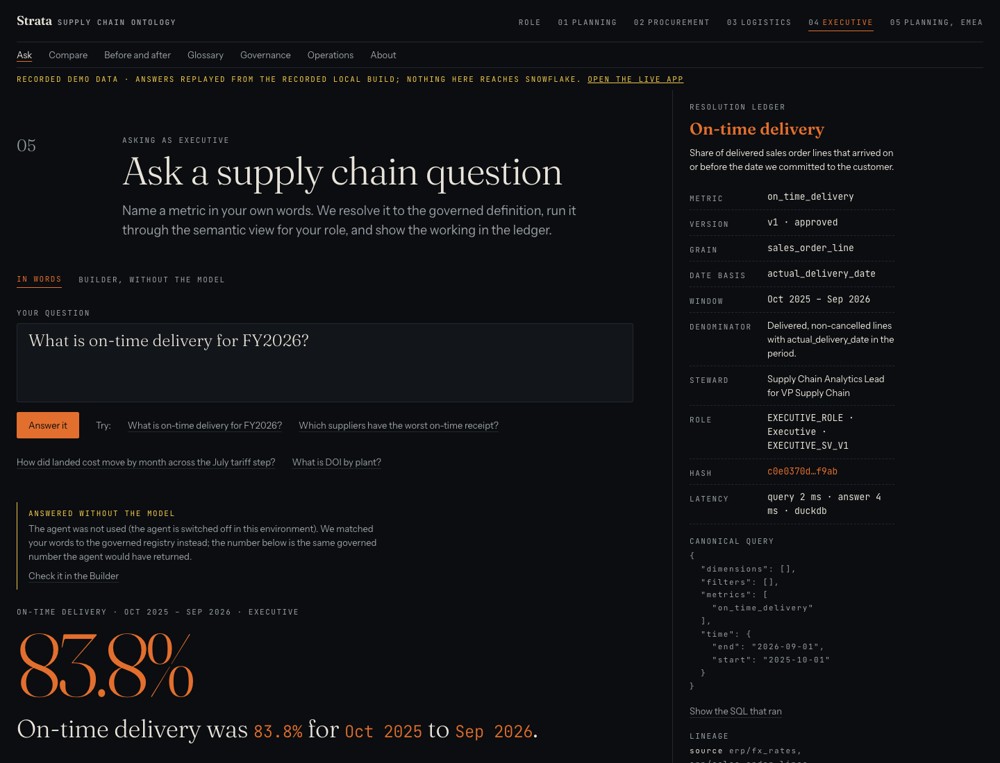
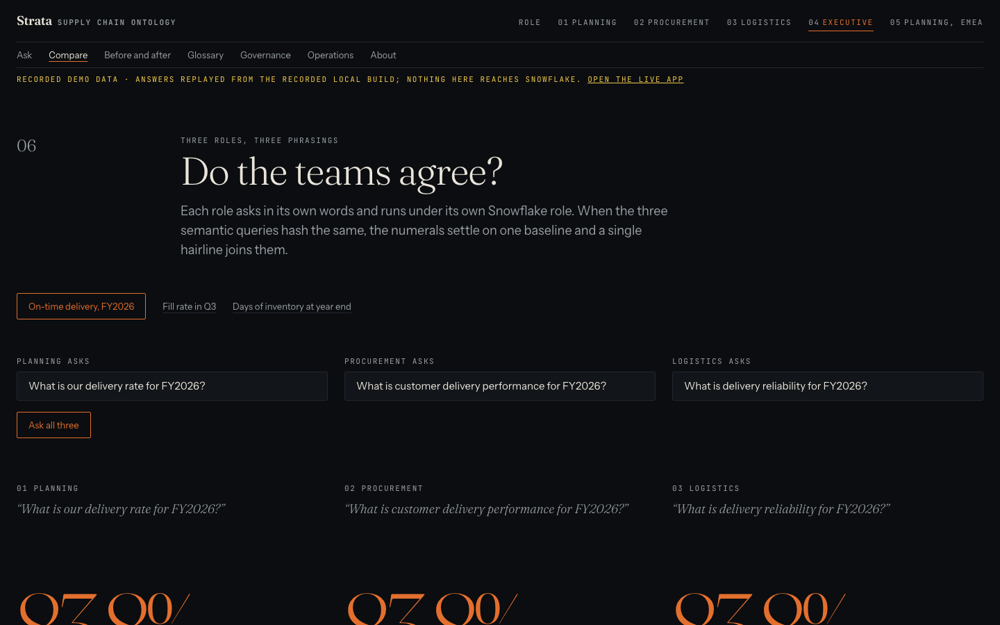
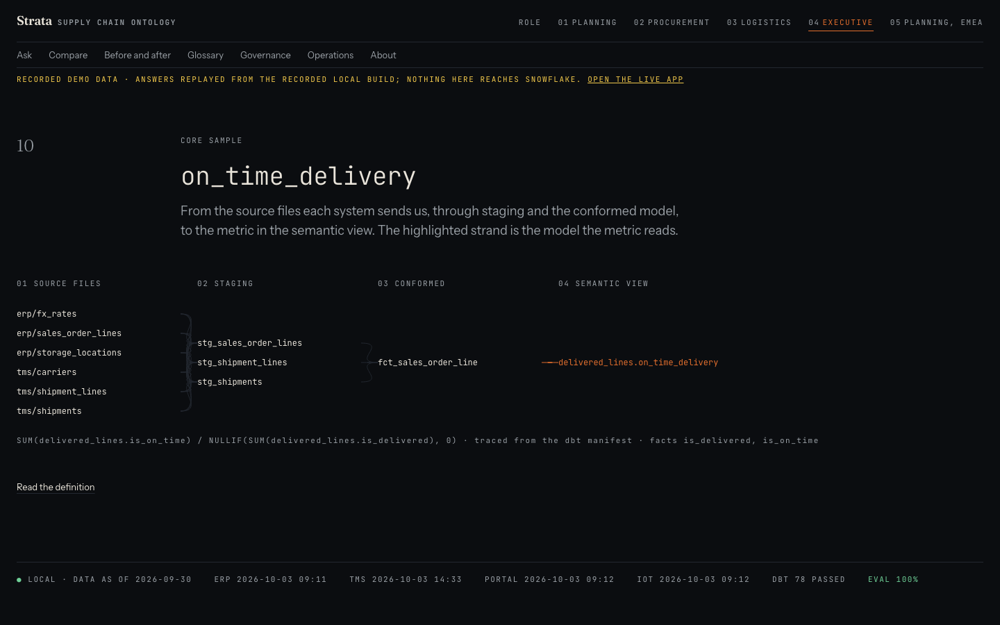

# STRATA — functional overview

## The problem

A supply chain business has one question asked four ways. Planning asks for "delivery rate",
procurement for "customer delivery performance", logistics for "delivery reliability", and the
executive team for "on-time". Each team computes it from its own extract with its own date basis, so
the numbers disagree in the meeting where they matter. Sensitive columns — supplier unit cost, bank
details, contact names — travel with those extracts.

## What STRATA does

STRATA defines every metric once, in an ontology registry (`ontology/metrics.yaml`): name,
definition, grain, date basis, window, numerator, denominator, owner, steward and approval. A
compiler turns that registry into five Snowflake semantic views (one governed view and one per
persona), dbt models and tests, a glossary with lineage, and interchange models. Only approved
metrics deploy to production.

People ask in their own words. A Cortex Agent reads the question and settles which governed metric,
dimensions and window it means. The number itself comes only from `GOVERNED_QUERY`, a procedure that
runs with the asker's rights on the asker's persona view and writes one audit row per answer or
refusal. The agent has no SQL tool and never sees a table name.

Every answer carries a ledger: the governed definition, the role and semantic view it ran under,
the canonical query, its hash, the SQL that ran and the lineage from source files to the metric.

## One question, one number

The same question in three phrasings, under three roles, resolves to one canonical query with one
hash and one number. The evaluation suite checks 20 such cases across three roles on the account,
and the hashes equal those the local engine computes.

## Each role sees what it may

Row scope and column rules are declared once (`ontology/entitlements.yaml`) and compiled into the
views. EMEA planning sees EMEA plants only. Procurement reads supplier unit cost; logistics, through
the same dimension, reads null. On Standard edition these are secure views; on Enterprise edition the
same rules compile to row access and masking policies.

## Pages

| Page | What it shows |
|---|---|
| Ask | A question in words, answered by the agent and the persona's governed query, with the ledger |
| Builder (on Ask) | The same answer built from metric, dimension and window, without the model |
| Compare | Three roles and three phrasings side by side, with their hashes |
| Before and after | Three legacy on-time calculations on raw data against the governed one |
| Glossary, Lineage | Every metric and variant with definition, steward and source-to-view path |
| Governance | The agent's tools, grants and policies, evaluation results, the audit trail |
| Operations | Freshness, service levels, alerts and the week's credits |

## Where it runs

The application runs in Snowpark Container Services; users sign in with their Snowflake account and
answer as their persona. A public mirror replays recorded answers for anyone without an account and
says so on every page. On the account, a task loop runs dbt and the evaluation suites and records
the results the Governance and Operations pages read; changes reach production only through the
deployment workflow once those gates pass.
