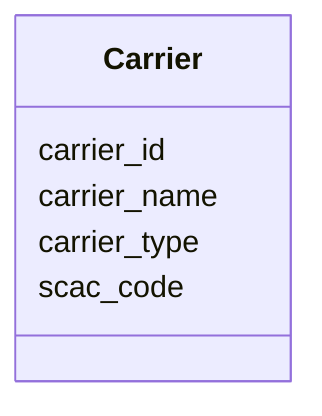

---
search:
  boost: 10.0
---

# Class: Carrier 


_A freight carrier or logistics service provider._


<div data-search-exclude markdown="1">


URI: [iof_scro:Carrier](https://spec.industrialontologies.org/ontology/supplychain/Carrier)





<!-- no inheritance hierarchy -->

## Class Properties

| Property | Value |
| --- | --- |
| Class URI | [iof_scro:Carrier](https://spec.industrialontologies.org/ontology/supplychain/Carrier) |


## Slots

| Name | Cardinality and Range | Description | Inheritance |
| ---  | --- | --- | --- |
| [carrier_id](carrier_id.md) | 1 <br/> [String](String.md) |  | direct |
| [carrier_name](carrier_name.md) | 0..1 <br/> [String](String.md) |  | direct |
| [carrier_type](carrier_type.md) | 0..1 <br/> [String](String.md) | OCEAN, AIR, ROAD, RAIL, PARCEL | direct |
| [scac_code](scac_code.md) | 0..1 <br/> [String](String.md) | Standard Carrier Alpha Code | direct |


## Usages

| used by | used in | type | used |
| ---  | --- | --- | --- |
| [Shipment](Shipment.md) | [carrier_id](carrier_id.md) | range | [Carrier](Carrier.md) |


## Identifier and Mapping Information


### Schema Source


* from schema: https://scm-ontology.example.com/schema


## Mappings

| Mapping Type | Mapped Value |
| ---  | ---  |
| self | iof_scro:Carrier |
| native | https://scm-ontology.example.com/schema/Carrier |


## LinkML Source

<!-- TODO: investigate https://stackoverflow.com/questions/37606292/how-to-create-tabbed-code-blocks-in-mkdocs-or-sphinx -->

### Direct

<details>
```yaml
name: Carrier
description: A freight carrier or logistics service provider.
from_schema: https://scm-ontology.example.com/schema
attributes:
  carrier_id:
    name: carrier_id
    from_schema: https://scm-ontology.example.com/schema
    identifier: true
    domain_of:
    - Shipment
    - Carrier
    range: string
  carrier_name:
    name: carrier_name
    from_schema: https://scm-ontology.example.com/schema
    rank: 1000
    domain_of:
    - Carrier
    range: string
  carrier_type:
    name: carrier_type
    description: OCEAN, AIR, ROAD, RAIL, PARCEL.
    from_schema: https://scm-ontology.example.com/schema
    rank: 1000
    domain_of:
    - Carrier
    range: string
  scac_code:
    name: scac_code
    description: Standard Carrier Alpha Code.
    from_schema: https://scm-ontology.example.com/schema
    rank: 1000
    domain_of:
    - Carrier
    range: string
class_uri: iof_scro:Carrier

```
</details>

### Induced

<details>
```yaml
name: Carrier
description: A freight carrier or logistics service provider.
from_schema: https://scm-ontology.example.com/schema
attributes:
  carrier_id:
    name: carrier_id
    from_schema: https://scm-ontology.example.com/schema
    identifier: true
    owner: Carrier
    domain_of:
    - Shipment
    - Carrier
    range: string
    required: true
  carrier_name:
    name: carrier_name
    from_schema: https://scm-ontology.example.com/schema
    rank: 1000
    owner: Carrier
    domain_of:
    - Carrier
    range: string
  carrier_type:
    name: carrier_type
    description: OCEAN, AIR, ROAD, RAIL, PARCEL.
    from_schema: https://scm-ontology.example.com/schema
    rank: 1000
    owner: Carrier
    domain_of:
    - Carrier
    range: string
  scac_code:
    name: scac_code
    description: Standard Carrier Alpha Code.
    from_schema: https://scm-ontology.example.com/schema
    rank: 1000
    owner: Carrier
    domain_of:
    - Carrier
    range: string
class_uri: iof_scro:Carrier

```
</details></div>