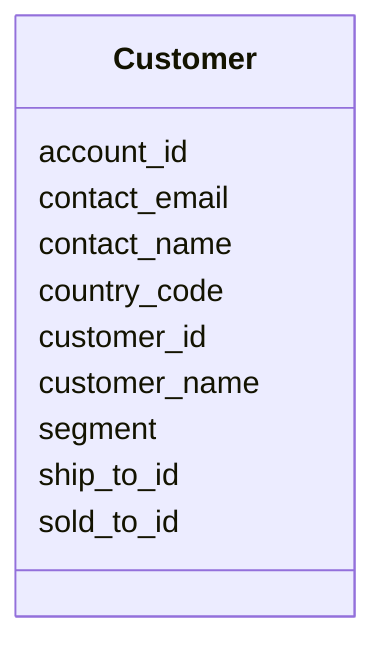

---
search:
  boost: 10.0
---

# Class: Customer 


_An organisation that purchases finished goods._


<div data-search-exclude markdown="1">


URI: [iof_scro:Customer](https://spec.industrialontologies.org/ontology/supplychain/Customer)





<!-- no inheritance hierarchy -->

## Class Properties

| Property | Value |
| --- | --- |
| Class URI | [iof_scro:Customer](https://spec.industrialontologies.org/ontology/supplychain/Customer) |


## Slots

| Name | Cardinality and Range | Description | Inheritance |
| ---  | --- | --- | --- |
| [customer_id](customer_id.md) | 1 <br/> [String](String.md) | Golden key for the customer | direct |
| [customer_name](customer_name.md) | 0..1 <br/> [String](String.md) |  | direct |
| [ship_to_id](ship_to_id.md) | 0..1 <br/> [String](String.md) | Ship-to location in the Customer hierarchy | direct |
| [sold_to_id](sold_to_id.md) | 0..1 <br/> [String](String.md) | Sold-to party | direct |
| [account_id](account_id.md) | 0..1 <br/> [String](String.md) | Account in the hierarchy | direct |
| [segment](segment.md) | 0..1 <br/> [String](String.md) | Market segment (Industrial, Retail, Government, Healthcare) | direct |
| [country_code](country_code.md) | 0..1 <br/> [String](String.md) |  | direct |
| [contact_name](contact_name.md) | 0..1 <br/> [String](String.md) |  | direct |
| [contact_email](contact_email.md) | 0..1 <br/> [String](String.md) |  | direct |


## Usages

| used by | used in | type | used |
| ---  | --- | --- | --- |
| [SalesOrderLine](SalesOrderLine.md) | [customer_id](customer_id.md) | range | [Customer](Customer.md) |


## Identifier and Mapping Information


### Schema Source


* from schema: https://scm-ontology.example.com/schema


## Mappings

| Mapping Type | Mapped Value |
| ---  | ---  |
| self | iof_scro:Customer |
| native | https://scm-ontology.example.com/schema/Customer |


## LinkML Source

<!-- TODO: investigate https://stackoverflow.com/questions/37606292/how-to-create-tabbed-code-blocks-in-mkdocs-or-sphinx -->

### Direct

<details>
```yaml
name: Customer
description: An organisation that purchases finished goods.
from_schema: https://scm-ontology.example.com/schema
attributes:
  customer_id:
    name: customer_id
    description: Golden key for the customer.
    from_schema: https://scm-ontology.example.com/schema
    rank: 1000
    identifier: true
    domain_of:
    - Customer
    - SalesOrderLine
    range: string
  customer_name:
    name: customer_name
    from_schema: https://scm-ontology.example.com/schema
    rank: 1000
    domain_of:
    - Customer
    range: string
  ship_to_id:
    name: ship_to_id
    description: Ship-to location in the Customer hierarchy.
    from_schema: https://scm-ontology.example.com/schema
    rank: 1000
    domain_of:
    - Customer
    range: string
  sold_to_id:
    name: sold_to_id
    description: Sold-to party.
    from_schema: https://scm-ontology.example.com/schema
    rank: 1000
    domain_of:
    - Customer
    range: string
  account_id:
    name: account_id
    description: Account in the hierarchy.
    from_schema: https://scm-ontology.example.com/schema
    rank: 1000
    domain_of:
    - Customer
    range: string
  segment:
    name: segment
    description: Market segment (Industrial, Retail, Government, Healthcare).
    from_schema: https://scm-ontology.example.com/schema
    rank: 1000
    domain_of:
    - Customer
    range: string
  country_code:
    name: country_code
    from_schema: https://scm-ontology.example.com/schema
    domain_of:
    - Supplier
    - Plant
    - Customer
    range: string
  contact_name:
    name: contact_name
    annotations:
      sensitivity:
        tag: sensitivity
        value: CONFIDENTIAL
    from_schema: https://scm-ontology.example.com/schema
    domain_of:
    - Supplier
    - Customer
    range: string
  contact_email:
    name: contact_email
    annotations:
      sensitivity:
        tag: sensitivity
        value: CONFIDENTIAL
    from_schema: https://scm-ontology.example.com/schema
    domain_of:
    - Supplier
    - Customer
    range: string
class_uri: iof_scro:Customer

```
</details>

### Induced

<details>
```yaml
name: Customer
description: An organisation that purchases finished goods.
from_schema: https://scm-ontology.example.com/schema
attributes:
  customer_id:
    name: customer_id
    description: Golden key for the customer.
    from_schema: https://scm-ontology.example.com/schema
    rank: 1000
    identifier: true
    owner: Customer
    domain_of:
    - Customer
    - SalesOrderLine
    range: string
    required: true
  customer_name:
    name: customer_name
    from_schema: https://scm-ontology.example.com/schema
    rank: 1000
    owner: Customer
    domain_of:
    - Customer
    range: string
  ship_to_id:
    name: ship_to_id
    description: Ship-to location in the Customer hierarchy.
    from_schema: https://scm-ontology.example.com/schema
    rank: 1000
    owner: Customer
    domain_of:
    - Customer
    range: string
  sold_to_id:
    name: sold_to_id
    description: Sold-to party.
    from_schema: https://scm-ontology.example.com/schema
    rank: 1000
    owner: Customer
    domain_of:
    - Customer
    range: string
  account_id:
    name: account_id
    description: Account in the hierarchy.
    from_schema: https://scm-ontology.example.com/schema
    rank: 1000
    owner: Customer
    domain_of:
    - Customer
    range: string
  segment:
    name: segment
    description: Market segment (Industrial, Retail, Government, Healthcare).
    from_schema: https://scm-ontology.example.com/schema
    rank: 1000
    owner: Customer
    domain_of:
    - Customer
    range: string
  country_code:
    name: country_code
    from_schema: https://scm-ontology.example.com/schema
    owner: Customer
    domain_of:
    - Supplier
    - Plant
    - Customer
    range: string
  contact_name:
    name: contact_name
    annotations:
      sensitivity:
        tag: sensitivity
        value: CONFIDENTIAL
    from_schema: https://scm-ontology.example.com/schema
    owner: Customer
    domain_of:
    - Supplier
    - Customer
    range: string
  contact_email:
    name: contact_email
    annotations:
      sensitivity:
        tag: sensitivity
        value: CONFIDENTIAL
    from_schema: https://scm-ontology.example.com/schema
    owner: Customer
    domain_of:
    - Supplier
    - Customer
    range: string
class_uri: iof_scro:Customer

```
</details></div>