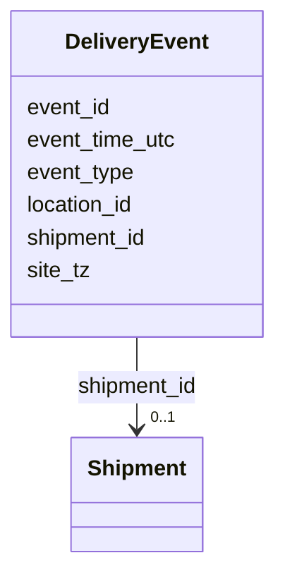

---
search:
  boost: 10.0
---

# Class: DeliveryEvent 


_A timestamped event in the lifecycle of a shipment._


<div data-search-exclude markdown="1">


URI: [https://scm-ontology.example.com/schema/DeliveryEvent](https://scm-ontology.example.com/schema/DeliveryEvent)





<!-- no inheritance hierarchy -->

## Slots

| Name | Cardinality and Range | Description | Inheritance |
| ---  | --- | --- | --- |
| [event_id](event_id.md) | 1 <br/> [String](String.md) |  | direct |
| [shipment_id](shipment_id.md) | 0..1 <br/> [Shipment](Shipment.md) |  | direct |
| [event_type](event_type.md) | 0..1 <br/> [String](String.md) | picked_up, departed, arrived, delivered, exception | direct |
| [event_time_utc](event_time_utc.md) | 0..1 <br/> [Datetime](Datetime.md) | Event timestamp in UTC | direct |
| [site_tz](site_tz.md) | 0..1 <br/> [String](String.md) | IANA timezone of the event location | direct |
| [location_id](location_id.md) | 0..1 <br/> [String](String.md) | Identifier of the event location | direct |


## Identifier and Mapping Information


### Schema Source


* from schema: https://scm-ontology.example.com/schema


## Mappings

| Mapping Type | Mapped Value |
| ---  | ---  |
| self | https://scm-ontology.example.com/schema/DeliveryEvent |
| native | https://scm-ontology.example.com/schema/DeliveryEvent |


## LinkML Source

<!-- TODO: investigate https://stackoverflow.com/questions/37606292/how-to-create-tabbed-code-blocks-in-mkdocs-or-sphinx -->

### Direct

<details>
```yaml
name: DeliveryEvent
description: A timestamped event in the lifecycle of a shipment.
from_schema: https://scm-ontology.example.com/schema
attributes:
  event_id:
    name: event_id
    from_schema: https://scm-ontology.example.com/schema
    rank: 1000
    identifier: true
    domain_of:
    - DeliveryEvent
    range: string
  shipment_id:
    name: shipment_id
    from_schema: https://scm-ontology.example.com/schema
    domain_of:
    - Shipment
    - ShipmentLine
    - DeliveryEvent
    range: Shipment
  event_type:
    name: event_type
    description: picked_up, departed, arrived, delivered, exception.
    from_schema: https://scm-ontology.example.com/schema
    rank: 1000
    domain_of:
    - DeliveryEvent
    range: string
  event_time_utc:
    name: event_time_utc
    description: Event timestamp in UTC.
    from_schema: https://scm-ontology.example.com/schema
    rank: 1000
    domain_of:
    - DeliveryEvent
    range: datetime
  site_tz:
    name: site_tz
    description: IANA timezone of the event location.
    from_schema: https://scm-ontology.example.com/schema
    rank: 1000
    domain_of:
    - DeliveryEvent
    range: string
  location_id:
    name: location_id
    description: Identifier of the event location.
    from_schema: https://scm-ontology.example.com/schema
    rank: 1000
    domain_of:
    - DeliveryEvent
    range: string

```
</details>

### Induced

<details>
```yaml
name: DeliveryEvent
description: A timestamped event in the lifecycle of a shipment.
from_schema: https://scm-ontology.example.com/schema
attributes:
  event_id:
    name: event_id
    from_schema: https://scm-ontology.example.com/schema
    rank: 1000
    identifier: true
    owner: DeliveryEvent
    domain_of:
    - DeliveryEvent
    range: string
    required: true
  shipment_id:
    name: shipment_id
    from_schema: https://scm-ontology.example.com/schema
    owner: DeliveryEvent
    domain_of:
    - Shipment
    - ShipmentLine
    - DeliveryEvent
    range: Shipment
  event_type:
    name: event_type
    description: picked_up, departed, arrived, delivered, exception.
    from_schema: https://scm-ontology.example.com/schema
    rank: 1000
    owner: DeliveryEvent
    domain_of:
    - DeliveryEvent
    range: string
  event_time_utc:
    name: event_time_utc
    description: Event timestamp in UTC.
    from_schema: https://scm-ontology.example.com/schema
    rank: 1000
    owner: DeliveryEvent
    domain_of:
    - DeliveryEvent
    range: datetime
  site_tz:
    name: site_tz
    description: IANA timezone of the event location.
    from_schema: https://scm-ontology.example.com/schema
    rank: 1000
    owner: DeliveryEvent
    domain_of:
    - DeliveryEvent
    range: string
  location_id:
    name: location_id
    description: Identifier of the event location.
    from_schema: https://scm-ontology.example.com/schema
    rank: 1000
    owner: DeliveryEvent
    domain_of:
    - DeliveryEvent
    range: string

```
</details></div>