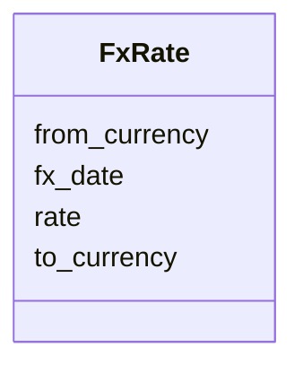

---
search:
  boost: 10.0
---

# Class: FxRate 


_A daily foreign exchange rate to USD; keyed by date and source currency._


<div data-search-exclude markdown="1">


URI: [https://scm-ontology.example.com/schema/FxRate](https://scm-ontology.example.com/schema/FxRate)





<!-- no inheritance hierarchy -->

## Slots

| Name | Cardinality and Range | Description | Inheritance |
| ---  | --- | --- | --- |
| [fx_date](fx_date.md) | 0..1 <br/> [Date](Date.md) |  | direct |
| [from_currency](from_currency.md) | 0..1 <br/> [String](String.md) | ISO 4217 source currency | direct |
| [to_currency](to_currency.md) | 0..1 <br/> [String](String.md) | Always USD | direct |
| [rate](rate.md) | 0..1 <br/> [Float](Float.md) | Units of to_currency per unit of from_currency | direct |


## Identifier and Mapping Information


### Schema Source


* from schema: https://scm-ontology.example.com/schema


## Mappings

| Mapping Type | Mapped Value |
| ---  | ---  |
| self | https://scm-ontology.example.com/schema/FxRate |
| native | https://scm-ontology.example.com/schema/FxRate |


## LinkML Source

<!-- TODO: investigate https://stackoverflow.com/questions/37606292/how-to-create-tabbed-code-blocks-in-mkdocs-or-sphinx -->

### Direct

<details>
```yaml
name: FxRate
description: A daily foreign exchange rate to USD; keyed by date and source currency.
from_schema: https://scm-ontology.example.com/schema
attributes:
  fx_date:
    name: fx_date
    from_schema: https://scm-ontology.example.com/schema
    rank: 1000
    domain_of:
    - FxRate
    range: date
  from_currency:
    name: from_currency
    description: ISO 4217 source currency.
    from_schema: https://scm-ontology.example.com/schema
    rank: 1000
    domain_of:
    - FxRate
    range: string
  to_currency:
    name: to_currency
    description: Always USD.
    from_schema: https://scm-ontology.example.com/schema
    rank: 1000
    domain_of:
    - FxRate
    range: string
  rate:
    name: rate
    description: Units of to_currency per unit of from_currency.
    from_schema: https://scm-ontology.example.com/schema
    rank: 1000
    domain_of:
    - FxRate
    range: float

```
</details>

### Induced

<details>
```yaml
name: FxRate
description: A daily foreign exchange rate to USD; keyed by date and source currency.
from_schema: https://scm-ontology.example.com/schema
attributes:
  fx_date:
    name: fx_date
    from_schema: https://scm-ontology.example.com/schema
    rank: 1000
    owner: FxRate
    domain_of:
    - FxRate
    range: date
  from_currency:
    name: from_currency
    description: ISO 4217 source currency.
    from_schema: https://scm-ontology.example.com/schema
    rank: 1000
    owner: FxRate
    domain_of:
    - FxRate
    range: string
  to_currency:
    name: to_currency
    description: Always USD.
    from_schema: https://scm-ontology.example.com/schema
    rank: 1000
    owner: FxRate
    domain_of:
    - FxRate
    range: string
  rate:
    name: rate
    description: Units of to_currency per unit of from_currency.
    from_schema: https://scm-ontology.example.com/schema
    rank: 1000
    owner: FxRate
    domain_of:
    - FxRate
    range: float

```
</details></div>