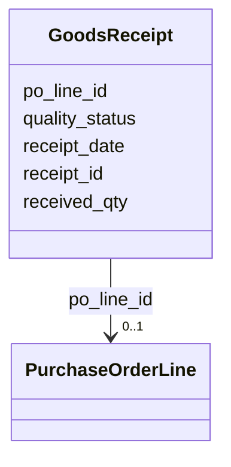

---
search:
  boost: 10.0
---

# Class: GoodsReceipt 


_A record of parts received against a purchase order line._


<div data-search-exclude markdown="1">


URI: [iof_scro:GoodsReceipt](https://spec.industrialontologies.org/ontology/supplychain/GoodsReceipt)





<!-- no inheritance hierarchy -->

## Class Properties

| Property | Value |
| --- | --- |
| Class URI | [iof_scro:GoodsReceipt](https://spec.industrialontologies.org/ontology/supplychain/GoodsReceipt) |


## Slots

| Name | Cardinality and Range | Description | Inheritance |
| ---  | --- | --- | --- |
| [receipt_id](receipt_id.md) | 1 <br/> [String](String.md) |  | direct |
| [po_line_id](po_line_id.md) | 0..1 <br/> [PurchaseOrderLine](PurchaseOrderLine.md) |  | direct |
| [receipt_date](receipt_date.md) | 0..1 <br/> [Date](Date.md) |  | direct |
| [received_qty](received_qty.md) | 0..1 <br/> [Float](Float.md) |  | direct |
| [quality_status](quality_status.md) | 0..1 <br/> [String](String.md) | ACCEPTED, REJECTED, QUARANTINE | direct |


## Identifier and Mapping Information


### Schema Source


* from schema: https://scm-ontology.example.com/schema


## Mappings

| Mapping Type | Mapped Value |
| ---  | ---  |
| self | iof_scro:GoodsReceipt |
| native | https://scm-ontology.example.com/schema/GoodsReceipt |


## LinkML Source

<!-- TODO: investigate https://stackoverflow.com/questions/37606292/how-to-create-tabbed-code-blocks-in-mkdocs-or-sphinx -->

### Direct

<details>
```yaml
name: GoodsReceipt
description: A record of parts received against a purchase order line.
from_schema: https://scm-ontology.example.com/schema
attributes:
  receipt_id:
    name: receipt_id
    from_schema: https://scm-ontology.example.com/schema
    rank: 1000
    identifier: true
    domain_of:
    - GoodsReceipt
    range: string
  po_line_id:
    name: po_line_id
    from_schema: https://scm-ontology.example.com/schema
    domain_of:
    - PurchaseOrderLine
    - GoodsReceipt
    range: PurchaseOrderLine
  receipt_date:
    name: receipt_date
    from_schema: https://scm-ontology.example.com/schema
    rank: 1000
    domain_of:
    - GoodsReceipt
    range: date
  received_qty:
    name: received_qty
    from_schema: https://scm-ontology.example.com/schema
    rank: 1000
    domain_of:
    - GoodsReceipt
    range: float
  quality_status:
    name: quality_status
    description: ACCEPTED, REJECTED, QUARANTINE.
    from_schema: https://scm-ontology.example.com/schema
    rank: 1000
    domain_of:
    - GoodsReceipt
    range: string
class_uri: iof_scro:GoodsReceipt

```
</details>

### Induced

<details>
```yaml
name: GoodsReceipt
description: A record of parts received against a purchase order line.
from_schema: https://scm-ontology.example.com/schema
attributes:
  receipt_id:
    name: receipt_id
    from_schema: https://scm-ontology.example.com/schema
    rank: 1000
    identifier: true
    owner: GoodsReceipt
    domain_of:
    - GoodsReceipt
    range: string
    required: true
  po_line_id:
    name: po_line_id
    from_schema: https://scm-ontology.example.com/schema
    owner: GoodsReceipt
    domain_of:
    - PurchaseOrderLine
    - GoodsReceipt
    range: PurchaseOrderLine
  receipt_date:
    name: receipt_date
    from_schema: https://scm-ontology.example.com/schema
    rank: 1000
    owner: GoodsReceipt
    domain_of:
    - GoodsReceipt
    range: date
  received_qty:
    name: received_qty
    from_schema: https://scm-ontology.example.com/schema
    rank: 1000
    owner: GoodsReceipt
    domain_of:
    - GoodsReceipt
    range: float
  quality_status:
    name: quality_status
    description: ACCEPTED, REJECTED, QUARANTINE.
    from_schema: https://scm-ontology.example.com/schema
    rank: 1000
    owner: GoodsReceipt
    domain_of:
    - GoodsReceipt
    range: string
class_uri: iof_scro:GoodsReceipt

```
</details></div>