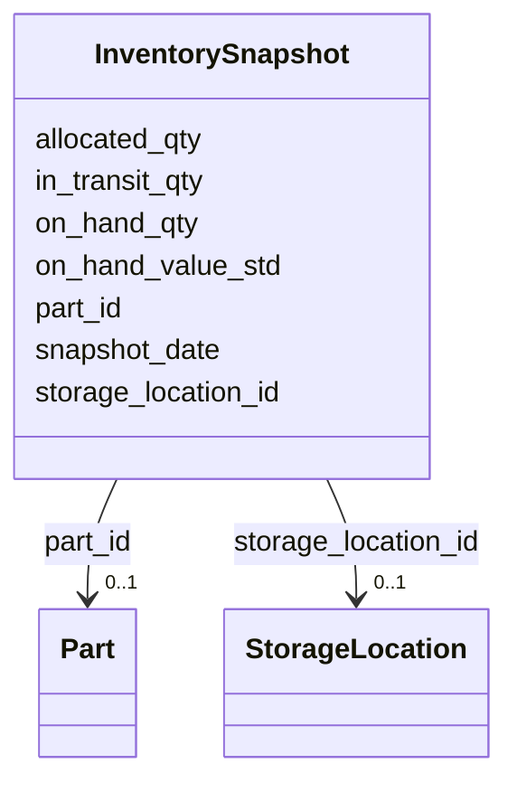

---
search:
  boost: 10.0
---

# Class: InventorySnapshot 


_A daily snapshot of inventory at a storage location for a part._


<div data-search-exclude markdown="1">


URI: [iof_scro:InventoryPosition](https://spec.industrialontologies.org/ontology/supplychain/InventoryPosition)





<!-- no inheritance hierarchy -->

## Class Properties

| Property | Value |
| --- | --- |
| Class URI | [iof_scro:InventoryPosition](https://spec.industrialontologies.org/ontology/supplychain/InventoryPosition) |


## Slots

| Name | Cardinality and Range | Description | Inheritance |
| ---  | --- | --- | --- |
| [storage_location_id](storage_location_id.md) | 0..1 <br/> [StorageLocation](StorageLocation.md) |  | direct |
| [part_id](part_id.md) | 0..1 <br/> [Part](Part.md) |  | direct |
| [snapshot_date](snapshot_date.md) | 0..1 <br/> [Date](Date.md) |  | direct |
| [on_hand_qty](on_hand_qty.md) | 0..1 <br/> [Float](Float.md) | Quantity on hand in base UOM | direct |
| [on_hand_value_std](on_hand_value_std.md) | 0..1 <br/> [Float](Float.md) | On-hand value in standard cost (USD) | direct |
| [in_transit_qty](in_transit_qty.md) | 0..1 <br/> [Float](Float.md) |  | direct |
| [allocated_qty](allocated_qty.md) | 0..1 <br/> [Float](Float.md) |  | direct |


## Identifier and Mapping Information


### Schema Source


* from schema: https://scm-ontology.example.com/schema


## Mappings

| Mapping Type | Mapped Value |
| ---  | ---  |
| self | iof_scro:InventoryPosition |
| native | https://scm-ontology.example.com/schema/InventorySnapshot |


## LinkML Source

<!-- TODO: investigate https://stackoverflow.com/questions/37606292/how-to-create-tabbed-code-blocks-in-mkdocs-or-sphinx -->

### Direct

<details>
```yaml
name: InventorySnapshot
description: A daily snapshot of inventory at a storage location for a part.
from_schema: https://scm-ontology.example.com/schema
attributes:
  storage_location_id:
    name: storage_location_id
    from_schema: https://scm-ontology.example.com/schema
    domain_of:
    - StorageLocation
    - InventorySnapshot
    range: StorageLocation
  part_id:
    name: part_id
    from_schema: https://scm-ontology.example.com/schema
    domain_of:
    - Part
    - SupplierPartAgreement
    - PurchaseOrderLine
    - SalesOrderLine
    - InventorySnapshot
    - TariffCode
    range: Part
  snapshot_date:
    name: snapshot_date
    from_schema: https://scm-ontology.example.com/schema
    rank: 1000
    domain_of:
    - InventorySnapshot
    range: date
  on_hand_qty:
    name: on_hand_qty
    description: Quantity on hand in base UOM.
    from_schema: https://scm-ontology.example.com/schema
    rank: 1000
    domain_of:
    - InventorySnapshot
    range: float
  on_hand_value_std:
    name: on_hand_value_std
    description: On-hand value in standard cost (USD).
    from_schema: https://scm-ontology.example.com/schema
    rank: 1000
    domain_of:
    - InventorySnapshot
    range: float
  in_transit_qty:
    name: in_transit_qty
    from_schema: https://scm-ontology.example.com/schema
    rank: 1000
    domain_of:
    - InventorySnapshot
    range: float
  allocated_qty:
    name: allocated_qty
    from_schema: https://scm-ontology.example.com/schema
    rank: 1000
    domain_of:
    - InventorySnapshot
    range: float
class_uri: iof_scro:InventoryPosition

```
</details>

### Induced

<details>
```yaml
name: InventorySnapshot
description: A daily snapshot of inventory at a storage location for a part.
from_schema: https://scm-ontology.example.com/schema
attributes:
  storage_location_id:
    name: storage_location_id
    from_schema: https://scm-ontology.example.com/schema
    owner: InventorySnapshot
    domain_of:
    - StorageLocation
    - InventorySnapshot
    range: StorageLocation
  part_id:
    name: part_id
    from_schema: https://scm-ontology.example.com/schema
    owner: InventorySnapshot
    domain_of:
    - Part
    - SupplierPartAgreement
    - PurchaseOrderLine
    - SalesOrderLine
    - InventorySnapshot
    - TariffCode
    range: Part
  snapshot_date:
    name: snapshot_date
    from_schema: https://scm-ontology.example.com/schema
    rank: 1000
    owner: InventorySnapshot
    domain_of:
    - InventorySnapshot
    range: date
  on_hand_qty:
    name: on_hand_qty
    description: Quantity on hand in base UOM.
    from_schema: https://scm-ontology.example.com/schema
    rank: 1000
    owner: InventorySnapshot
    domain_of:
    - InventorySnapshot
    range: float
  on_hand_value_std:
    name: on_hand_value_std
    description: On-hand value in standard cost (USD).
    from_schema: https://scm-ontology.example.com/schema
    rank: 1000
    owner: InventorySnapshot
    domain_of:
    - InventorySnapshot
    range: float
  in_transit_qty:
    name: in_transit_qty
    from_schema: https://scm-ontology.example.com/schema
    rank: 1000
    owner: InventorySnapshot
    domain_of:
    - InventorySnapshot
    range: float
  allocated_qty:
    name: allocated_qty
    from_schema: https://scm-ontology.example.com/schema
    rank: 1000
    owner: InventorySnapshot
    domain_of:
    - InventorySnapshot
    range: float
class_uri: iof_scro:InventoryPosition

```
</details></div>