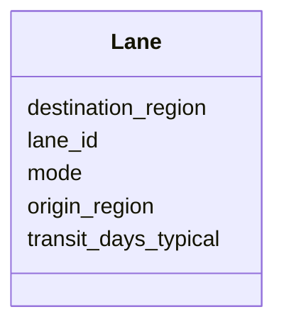

---
search:
  boost: 10.0
---

# Class: Lane 


_A defined transportation route between an origin and destination._


<div data-search-exclude markdown="1">


URI: [https://scm-ontology.example.com/schema/Lane](https://scm-ontology.example.com/schema/Lane)





<!-- no inheritance hierarchy -->

## Slots

| Name | Cardinality and Range | Description | Inheritance |
| ---  | --- | --- | --- |
| [lane_id](lane_id.md) | 1 <br/> [String](String.md) |  | direct |
| [origin_region](origin_region.md) | 0..1 <br/> [String](String.md) |  | direct |
| [destination_region](destination_region.md) | 0..1 <br/> [String](String.md) |  | direct |
| [mode](mode.md) | 0..1 <br/> [String](String.md) | Primary transport mode | direct |
| [transit_days_typical](transit_days_typical.md) | 0..1 <br/> [Integer](Integer.md) |  | direct |


## Usages

| used by | used in | type | used |
| ---  | --- | --- | --- |
| [Shipment](Shipment.md) | [lane_id](lane_id.md) | range | [Lane](Lane.md) |


## Identifier and Mapping Information


### Schema Source


* from schema: https://scm-ontology.example.com/schema


## Mappings

| Mapping Type | Mapped Value |
| ---  | ---  |
| self | https://scm-ontology.example.com/schema/Lane |
| native | https://scm-ontology.example.com/schema/Lane |


## LinkML Source

<!-- TODO: investigate https://stackoverflow.com/questions/37606292/how-to-create-tabbed-code-blocks-in-mkdocs-or-sphinx -->

### Direct

<details>
```yaml
name: Lane
description: A defined transportation route between an origin and destination.
from_schema: https://scm-ontology.example.com/schema
attributes:
  lane_id:
    name: lane_id
    from_schema: https://scm-ontology.example.com/schema
    identifier: true
    domain_of:
    - Shipment
    - Lane
    range: string
  origin_region:
    name: origin_region
    from_schema: https://scm-ontology.example.com/schema
    rank: 1000
    domain_of:
    - Lane
    range: string
  destination_region:
    name: destination_region
    from_schema: https://scm-ontology.example.com/schema
    rank: 1000
    domain_of:
    - Lane
    range: string
  mode:
    name: mode
    description: Primary transport mode.
    from_schema: https://scm-ontology.example.com/schema
    rank: 1000
    domain_of:
    - Lane
    range: string
  transit_days_typical:
    name: transit_days_typical
    from_schema: https://scm-ontology.example.com/schema
    rank: 1000
    domain_of:
    - Lane
    range: integer

```
</details>

### Induced

<details>
```yaml
name: Lane
description: A defined transportation route between an origin and destination.
from_schema: https://scm-ontology.example.com/schema
attributes:
  lane_id:
    name: lane_id
    from_schema: https://scm-ontology.example.com/schema
    identifier: true
    owner: Lane
    domain_of:
    - Shipment
    - Lane
    range: string
    required: true
  origin_region:
    name: origin_region
    from_schema: https://scm-ontology.example.com/schema
    rank: 1000
    owner: Lane
    domain_of:
    - Lane
    range: string
  destination_region:
    name: destination_region
    from_schema: https://scm-ontology.example.com/schema
    rank: 1000
    owner: Lane
    domain_of:
    - Lane
    range: string
  mode:
    name: mode
    description: Primary transport mode.
    from_schema: https://scm-ontology.example.com/schema
    rank: 1000
    owner: Lane
    domain_of:
    - Lane
    range: string
  transit_days_typical:
    name: transit_days_typical
    from_schema: https://scm-ontology.example.com/schema
    rank: 1000
    owner: Lane
    domain_of:
    - Lane
    range: integer

```
</details></div>