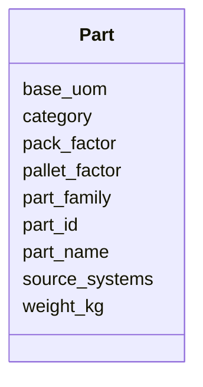

---
search:
  boost: 10.0
---

# Class: Part 


_A stock-keeping unit that can be purchased, stored, and sold._


<div data-search-exclude markdown="1">


URI: [iof_scro:MaterialProduct](https://spec.industrialontologies.org/ontology/supplychain/MaterialProduct)





<!-- no inheritance hierarchy -->

## Class Properties

| Property | Value |
| --- | --- |
| Class URI | [iof_scro:MaterialProduct](https://spec.industrialontologies.org/ontology/supplychain/MaterialProduct) |


## Slots

| Name | Cardinality and Range | Description | Inheritance |
| ---  | --- | --- | --- |
| [part_id](part_id.md) | 1 <br/> [String](String.md) | Golden key for the part | direct |
| [part_name](part_name.md) | 0..1 <br/> [String](String.md) |  | direct |
| [part_family](part_family.md) | 0..1 <br/> [String](String.md) | Product family in the Part > ProductFamily > Category hierarchy | direct |
| [category](category.md) | 0..1 <br/> [String](String.md) | Top-level category | direct |
| [base_uom](base_uom.md) | 0..1 <br/> [String](String.md) | Base unit of measure (each, kg, litre) | direct |
| [pack_factor](pack_factor.md) | 0..1 <br/> [Float](Float.md) | Units per case | direct |
| [pallet_factor](pallet_factor.md) | 0..1 <br/> [Float](Float.md) | Cases per pallet | direct |
| [weight_kg](weight_kg.md) | 0..1 <br/> [Float](Float.md) | Unit weight in kilograms | direct |
| [source_systems](source_systems.md) | * <br/> [String](String.md) |  | direct |


## Usages

| used by | used in | type | used |
| ---  | --- | --- | --- |
| [SupplierPartAgreement](SupplierPartAgreement.md) | [part_id](part_id.md) | range | [Part](Part.md) |
| [PurchaseOrderLine](PurchaseOrderLine.md) | [part_id](part_id.md) | range | [Part](Part.md) |
| [SalesOrderLine](SalesOrderLine.md) | [part_id](part_id.md) | range | [Part](Part.md) |
| [InventorySnapshot](InventorySnapshot.md) | [part_id](part_id.md) | range | [Part](Part.md) |
| [TariffCode](TariffCode.md) | [part_id](part_id.md) | range | [Part](Part.md) |


## Identifier and Mapping Information


### Schema Source


* from schema: https://scm-ontology.example.com/schema


## Mappings

| Mapping Type | Mapped Value |
| ---  | ---  |
| self | iof_scro:MaterialProduct |
| native | https://scm-ontology.example.com/schema/Part |


## LinkML Source

<!-- TODO: investigate https://stackoverflow.com/questions/37606292/how-to-create-tabbed-code-blocks-in-mkdocs-or-sphinx -->

### Direct

<details>
```yaml
name: Part
description: A stock-keeping unit that can be purchased, stored, and sold.
from_schema: https://scm-ontology.example.com/schema
attributes:
  part_id:
    name: part_id
    description: Golden key for the part.
    from_schema: https://scm-ontology.example.com/schema
    rank: 1000
    identifier: true
    domain_of:
    - Part
    - SupplierPartAgreement
    - PurchaseOrderLine
    - SalesOrderLine
    - InventorySnapshot
    - TariffCode
    range: string
  part_name:
    name: part_name
    from_schema: https://scm-ontology.example.com/schema
    rank: 1000
    domain_of:
    - Part
    range: string
  part_family:
    name: part_family
    description: Product family in the Part > ProductFamily > Category hierarchy.
    from_schema: https://scm-ontology.example.com/schema
    rank: 1000
    domain_of:
    - Part
    range: string
  category:
    name: category
    description: Top-level category.
    from_schema: https://scm-ontology.example.com/schema
    rank: 1000
    domain_of:
    - Part
    range: string
  base_uom:
    name: base_uom
    description: Base unit of measure (each, kg, litre).
    from_schema: https://scm-ontology.example.com/schema
    rank: 1000
    domain_of:
    - Part
    range: string
  pack_factor:
    name: pack_factor
    description: Units per case.
    from_schema: https://scm-ontology.example.com/schema
    rank: 1000
    domain_of:
    - Part
    range: float
  pallet_factor:
    name: pallet_factor
    description: Cases per pallet.
    from_schema: https://scm-ontology.example.com/schema
    rank: 1000
    domain_of:
    - Part
    range: float
  weight_kg:
    name: weight_kg
    description: Unit weight in kilograms.
    from_schema: https://scm-ontology.example.com/schema
    rank: 1000
    domain_of:
    - Part
    range: float
  source_systems:
    name: source_systems
    from_schema: https://scm-ontology.example.com/schema
    domain_of:
    - Supplier
    - Part
    range: string
    multivalued: true
class_uri: iof_scro:MaterialProduct

```
</details>

### Induced

<details>
```yaml
name: Part
description: A stock-keeping unit that can be purchased, stored, and sold.
from_schema: https://scm-ontology.example.com/schema
attributes:
  part_id:
    name: part_id
    description: Golden key for the part.
    from_schema: https://scm-ontology.example.com/schema
    rank: 1000
    identifier: true
    owner: Part
    domain_of:
    - Part
    - SupplierPartAgreement
    - PurchaseOrderLine
    - SalesOrderLine
    - InventorySnapshot
    - TariffCode
    range: string
    required: true
  part_name:
    name: part_name
    from_schema: https://scm-ontology.example.com/schema
    rank: 1000
    owner: Part
    domain_of:
    - Part
    range: string
  part_family:
    name: part_family
    description: Product family in the Part > ProductFamily > Category hierarchy.
    from_schema: https://scm-ontology.example.com/schema
    rank: 1000
    owner: Part
    domain_of:
    - Part
    range: string
  category:
    name: category
    description: Top-level category.
    from_schema: https://scm-ontology.example.com/schema
    rank: 1000
    owner: Part
    domain_of:
    - Part
    range: string
  base_uom:
    name: base_uom
    description: Base unit of measure (each, kg, litre).
    from_schema: https://scm-ontology.example.com/schema
    rank: 1000
    owner: Part
    domain_of:
    - Part
    range: string
  pack_factor:
    name: pack_factor
    description: Units per case.
    from_schema: https://scm-ontology.example.com/schema
    rank: 1000
    owner: Part
    domain_of:
    - Part
    range: float
  pallet_factor:
    name: pallet_factor
    description: Cases per pallet.
    from_schema: https://scm-ontology.example.com/schema
    rank: 1000
    owner: Part
    domain_of:
    - Part
    range: float
  weight_kg:
    name: weight_kg
    description: Unit weight in kilograms.
    from_schema: https://scm-ontology.example.com/schema
    rank: 1000
    owner: Part
    domain_of:
    - Part
    range: float
  source_systems:
    name: source_systems
    from_schema: https://scm-ontology.example.com/schema
    owner: Part
    domain_of:
    - Supplier
    - Part
    range: string
    multivalued: true
class_uri: iof_scro:MaterialProduct

```
</details></div>