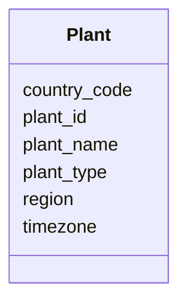

---
search:
  boost: 10.0
---

# Class: Plant 


_A manufacturing or distribution facility._


<div data-search-exclude markdown="1">


URI: [iof_scro:Facility](https://spec.industrialontologies.org/ontology/supplychain/Facility)





<!-- no inheritance hierarchy -->

## Class Properties

| Property | Value |
| --- | --- |
| Class URI | [iof_scro:Facility](https://spec.industrialontologies.org/ontology/supplychain/Facility) |


## Slots

| Name | Cardinality and Range | Description | Inheritance |
| ---  | --- | --- | --- |
| [plant_id](plant_id.md) | 1 <br/> [String](String.md) |  | direct |
| [plant_name](plant_name.md) | 0..1 <br/> [String](String.md) |  | direct |
| [plant_type](plant_type.md) | 0..1 <br/> [String](String.md) | MANUFACTURING or DISTRIBUTION | direct |
| [region](region.md) | 0..1 <br/> [String](String.md) | Geographic region (US, EMEA, APAC) | direct |
| [country_code](country_code.md) | 0..1 <br/> [String](String.md) |  | direct |
| [timezone](timezone.md) | 0..1 <br/> [String](String.md) | IANA timezone identifier (e | direct |


## Usages

| used by | used in | type | used |
| ---  | --- | --- | --- |
| [StorageLocation](StorageLocation.md) | [plant_id](plant_id.md) | range | [Plant](Plant.md) |
| [PurchaseOrderLine](PurchaseOrderLine.md) | [deliver_to_plant_id](deliver_to_plant_id.md) | range | [Plant](Plant.md) |
| [Shipment](Shipment.md) | [origin_plant_id](origin_plant_id.md) | range | [Plant](Plant.md) |


## Identifier and Mapping Information


### Schema Source


* from schema: https://scm-ontology.example.com/schema


## Mappings

| Mapping Type | Mapped Value |
| ---  | ---  |
| self | iof_scro:Facility |
| native | https://scm-ontology.example.com/schema/Plant |


## LinkML Source

<!-- TODO: investigate https://stackoverflow.com/questions/37606292/how-to-create-tabbed-code-blocks-in-mkdocs-or-sphinx -->

### Direct

<details>
```yaml
name: Plant
description: A manufacturing or distribution facility.
from_schema: https://scm-ontology.example.com/schema
attributes:
  plant_id:
    name: plant_id
    from_schema: https://scm-ontology.example.com/schema
    rank: 1000
    identifier: true
    domain_of:
    - Plant
    - StorageLocation
    range: string
  plant_name:
    name: plant_name
    from_schema: https://scm-ontology.example.com/schema
    rank: 1000
    domain_of:
    - Plant
    range: string
  plant_type:
    name: plant_type
    description: MANUFACTURING or DISTRIBUTION.
    from_schema: https://scm-ontology.example.com/schema
    rank: 1000
    domain_of:
    - Plant
    range: string
  region:
    name: region
    description: Geographic region (US, EMEA, APAC).
    from_schema: https://scm-ontology.example.com/schema
    rank: 1000
    domain_of:
    - Plant
    range: string
  country_code:
    name: country_code
    from_schema: https://scm-ontology.example.com/schema
    domain_of:
    - Supplier
    - Plant
    - Customer
    range: string
  timezone:
    name: timezone
    description: IANA timezone identifier (e.g. America/Chicago).
    from_schema: https://scm-ontology.example.com/schema
    rank: 1000
    domain_of:
    - Plant
    range: string
class_uri: iof_scro:Facility

```
</details>

### Induced

<details>
```yaml
name: Plant
description: A manufacturing or distribution facility.
from_schema: https://scm-ontology.example.com/schema
attributes:
  plant_id:
    name: plant_id
    from_schema: https://scm-ontology.example.com/schema
    rank: 1000
    identifier: true
    owner: Plant
    domain_of:
    - Plant
    - StorageLocation
    range: string
    required: true
  plant_name:
    name: plant_name
    from_schema: https://scm-ontology.example.com/schema
    rank: 1000
    owner: Plant
    domain_of:
    - Plant
    range: string
  plant_type:
    name: plant_type
    description: MANUFACTURING or DISTRIBUTION.
    from_schema: https://scm-ontology.example.com/schema
    rank: 1000
    owner: Plant
    domain_of:
    - Plant
    range: string
  region:
    name: region
    description: Geographic region (US, EMEA, APAC).
    from_schema: https://scm-ontology.example.com/schema
    rank: 1000
    owner: Plant
    domain_of:
    - Plant
    range: string
  country_code:
    name: country_code
    from_schema: https://scm-ontology.example.com/schema
    owner: Plant
    domain_of:
    - Supplier
    - Plant
    - Customer
    range: string
  timezone:
    name: timezone
    description: IANA timezone identifier (e.g. America/Chicago).
    from_schema: https://scm-ontology.example.com/schema
    rank: 1000
    owner: Plant
    domain_of:
    - Plant
    range: string
class_uri: iof_scro:Facility

```
</details></div>