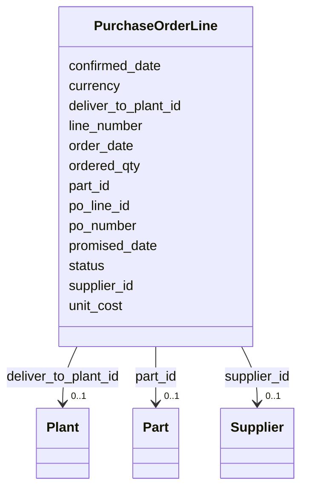

---
search:
  boost: 10.0
---

# Class: PurchaseOrderLine 


_A line on a purchase order placed with a supplier._


<div data-search-exclude markdown="1">


URI: [iof_scro:PurchaseOrderLine](https://spec.industrialontologies.org/ontology/supplychain/PurchaseOrderLine)





<!-- no inheritance hierarchy -->

## Class Properties

| Property | Value |
| --- | --- |
| Class URI | [iof_scro:PurchaseOrderLine](https://spec.industrialontologies.org/ontology/supplychain/PurchaseOrderLine) |


## Slots

| Name | Cardinality and Range | Description | Inheritance |
| ---  | --- | --- | --- |
| [po_line_id](po_line_id.md) | 1 <br/> [String](String.md) |  | direct |
| [po_number](po_number.md) | 0..1 <br/> [String](String.md) |  | direct |
| [line_number](line_number.md) | 0..1 <br/> [Integer](Integer.md) |  | direct |
| [supplier_id](supplier_id.md) | 0..1 <br/> [Supplier](Supplier.md) |  | direct |
| [part_id](part_id.md) | 0..1 <br/> [Part](Part.md) |  | direct |
| [deliver_to_plant_id](deliver_to_plant_id.md) | 0..1 <br/> [Plant](Plant.md) |  | direct |
| [ordered_qty](ordered_qty.md) | 0..1 <br/> [Float](Float.md) |  | direct |
| [unit_cost](unit_cost.md) | 0..1 <br/> [Float](Float.md) |  | direct |
| [currency](currency.md) | 0..1 <br/> [String](String.md) |  | direct |
| [order_date](order_date.md) | 0..1 <br/> [Date](Date.md) |  | direct |
| [promised_date](promised_date.md) | 0..1 <br/> [Date](Date.md) | Supplier-promised delivery date | direct |
| [confirmed_date](confirmed_date.md) | 0..1 <br/> [Date](Date.md) | Supplier-confirmed delivery date (may differ from promised) | direct |
| [status](status.md) | 0..1 <br/> [String](String.md) | OPEN, RECEIVED, PARTIAL, CANCELLED | direct |


## Usages

| used by | used in | type | used |
| ---  | --- | --- | --- |
| [GoodsReceipt](GoodsReceipt.md) | [po_line_id](po_line_id.md) | range | [PurchaseOrderLine](PurchaseOrderLine.md) |


## Identifier and Mapping Information


### Schema Source


* from schema: https://scm-ontology.example.com/schema


## Mappings

| Mapping Type | Mapped Value |
| ---  | ---  |
| self | iof_scro:PurchaseOrderLine |
| native | https://scm-ontology.example.com/schema/PurchaseOrderLine |


## LinkML Source

<!-- TODO: investigate https://stackoverflow.com/questions/37606292/how-to-create-tabbed-code-blocks-in-mkdocs-or-sphinx -->

### Direct

<details>
```yaml
name: PurchaseOrderLine
description: A line on a purchase order placed with a supplier.
from_schema: https://scm-ontology.example.com/schema
attributes:
  po_line_id:
    name: po_line_id
    from_schema: https://scm-ontology.example.com/schema
    rank: 1000
    identifier: true
    domain_of:
    - PurchaseOrderLine
    - GoodsReceipt
    range: string
  po_number:
    name: po_number
    from_schema: https://scm-ontology.example.com/schema
    rank: 1000
    domain_of:
    - PurchaseOrderLine
    range: string
  line_number:
    name: line_number
    from_schema: https://scm-ontology.example.com/schema
    rank: 1000
    domain_of:
    - PurchaseOrderLine
    - SalesOrderLine
    range: integer
  supplier_id:
    name: supplier_id
    from_schema: https://scm-ontology.example.com/schema
    domain_of:
    - Supplier
    - SupplierPartAgreement
    - PurchaseOrderLine
    range: Supplier
  part_id:
    name: part_id
    from_schema: https://scm-ontology.example.com/schema
    domain_of:
    - Part
    - SupplierPartAgreement
    - PurchaseOrderLine
    - SalesOrderLine
    - InventorySnapshot
    - TariffCode
    range: Part
  deliver_to_plant_id:
    name: deliver_to_plant_id
    from_schema: https://scm-ontology.example.com/schema
    rank: 1000
    domain_of:
    - PurchaseOrderLine
    range: Plant
  ordered_qty:
    name: ordered_qty
    from_schema: https://scm-ontology.example.com/schema
    rank: 1000
    domain_of:
    - PurchaseOrderLine
    - SalesOrderLine
    range: float
  unit_cost:
    name: unit_cost
    annotations:
      sensitivity:
        tag: sensitivity
        value: RESTRICTED
    from_schema: https://scm-ontology.example.com/schema
    domain_of:
    - SupplierPartAgreement
    - PurchaseOrderLine
    range: float
  currency:
    name: currency
    from_schema: https://scm-ontology.example.com/schema
    domain_of:
    - SupplierPartAgreement
    - PurchaseOrderLine
    - SalesOrderLine
    range: string
  order_date:
    name: order_date
    from_schema: https://scm-ontology.example.com/schema
    rank: 1000
    domain_of:
    - PurchaseOrderLine
    range: date
  promised_date:
    name: promised_date
    description: Supplier-promised delivery date.
    from_schema: https://scm-ontology.example.com/schema
    rank: 1000
    domain_of:
    - PurchaseOrderLine
    range: date
  confirmed_date:
    name: confirmed_date
    description: Supplier-confirmed delivery date (may differ from promised).
    from_schema: https://scm-ontology.example.com/schema
    rank: 1000
    domain_of:
    - PurchaseOrderLine
    range: date
  status:
    name: status
    description: OPEN, RECEIVED, PARTIAL, CANCELLED.
    from_schema: https://scm-ontology.example.com/schema
    rank: 1000
    domain_of:
    - PurchaseOrderLine
    - SalesOrderLine
    - Shipment
    range: string
class_uri: iof_scro:PurchaseOrderLine

```
</details>

### Induced

<details>
```yaml
name: PurchaseOrderLine
description: A line on a purchase order placed with a supplier.
from_schema: https://scm-ontology.example.com/schema
attributes:
  po_line_id:
    name: po_line_id
    from_schema: https://scm-ontology.example.com/schema
    rank: 1000
    identifier: true
    owner: PurchaseOrderLine
    domain_of:
    - PurchaseOrderLine
    - GoodsReceipt
    range: string
    required: true
  po_number:
    name: po_number
    from_schema: https://scm-ontology.example.com/schema
    rank: 1000
    owner: PurchaseOrderLine
    domain_of:
    - PurchaseOrderLine
    range: string
  line_number:
    name: line_number
    from_schema: https://scm-ontology.example.com/schema
    rank: 1000
    owner: PurchaseOrderLine
    domain_of:
    - PurchaseOrderLine
    - SalesOrderLine
    range: integer
  supplier_id:
    name: supplier_id
    from_schema: https://scm-ontology.example.com/schema
    owner: PurchaseOrderLine
    domain_of:
    - Supplier
    - SupplierPartAgreement
    - PurchaseOrderLine
    range: Supplier
  part_id:
    name: part_id
    from_schema: https://scm-ontology.example.com/schema
    owner: PurchaseOrderLine
    domain_of:
    - Part
    - SupplierPartAgreement
    - PurchaseOrderLine
    - SalesOrderLine
    - InventorySnapshot
    - TariffCode
    range: Part
  deliver_to_plant_id:
    name: deliver_to_plant_id
    from_schema: https://scm-ontology.example.com/schema
    rank: 1000
    owner: PurchaseOrderLine
    domain_of:
    - PurchaseOrderLine
    range: Plant
  ordered_qty:
    name: ordered_qty
    from_schema: https://scm-ontology.example.com/schema
    rank: 1000
    owner: PurchaseOrderLine
    domain_of:
    - PurchaseOrderLine
    - SalesOrderLine
    range: float
  unit_cost:
    name: unit_cost
    annotations:
      sensitivity:
        tag: sensitivity
        value: RESTRICTED
    from_schema: https://scm-ontology.example.com/schema
    owner: PurchaseOrderLine
    domain_of:
    - SupplierPartAgreement
    - PurchaseOrderLine
    range: float
  currency:
    name: currency
    from_schema: https://scm-ontology.example.com/schema
    owner: PurchaseOrderLine
    domain_of:
    - SupplierPartAgreement
    - PurchaseOrderLine
    - SalesOrderLine
    range: string
  order_date:
    name: order_date
    from_schema: https://scm-ontology.example.com/schema
    rank: 1000
    owner: PurchaseOrderLine
    domain_of:
    - PurchaseOrderLine
    range: date
  promised_date:
    name: promised_date
    description: Supplier-promised delivery date.
    from_schema: https://scm-ontology.example.com/schema
    rank: 1000
    owner: PurchaseOrderLine
    domain_of:
    - PurchaseOrderLine
    range: date
  confirmed_date:
    name: confirmed_date
    description: Supplier-confirmed delivery date (may differ from promised).
    from_schema: https://scm-ontology.example.com/schema
    rank: 1000
    owner: PurchaseOrderLine
    domain_of:
    - PurchaseOrderLine
    range: date
  status:
    name: status
    description: OPEN, RECEIVED, PARTIAL, CANCELLED.
    from_schema: https://scm-ontology.example.com/schema
    rank: 1000
    owner: PurchaseOrderLine
    domain_of:
    - PurchaseOrderLine
    - SalesOrderLine
    - Shipment
    range: string
class_uri: iof_scro:PurchaseOrderLine

```
</details></div>