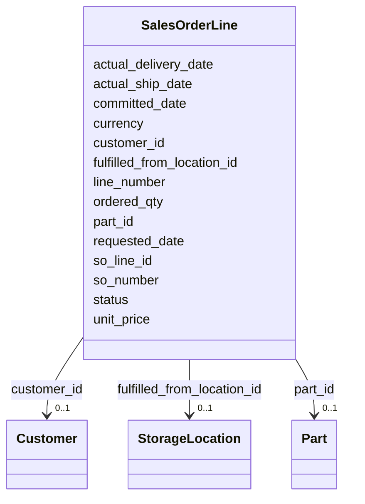

---
search:
  boost: 10.0
---

# Class: SalesOrderLine 


_A line on a customer sales order._


<div data-search-exclude markdown="1">


URI: [iof_scro:SalesOrderLine](https://spec.industrialontologies.org/ontology/supplychain/SalesOrderLine)





<!-- no inheritance hierarchy -->

## Class Properties

| Property | Value |
| --- | --- |
| Class URI | [iof_scro:SalesOrderLine](https://spec.industrialontologies.org/ontology/supplychain/SalesOrderLine) |


## Slots

| Name | Cardinality and Range | Description | Inheritance |
| ---  | --- | --- | --- |
| [so_line_id](so_line_id.md) | 1 <br/> [String](String.md) |  | direct |
| [so_number](so_number.md) | 0..1 <br/> [String](String.md) |  | direct |
| [line_number](line_number.md) | 0..1 <br/> [Integer](Integer.md) |  | direct |
| [customer_id](customer_id.md) | 0..1 <br/> [Customer](Customer.md) |  | direct |
| [part_id](part_id.md) | 0..1 <br/> [Part](Part.md) |  | direct |
| [fulfilled_from_location_id](fulfilled_from_location_id.md) | 0..1 <br/> [StorageLocation](StorageLocation.md) |  | direct |
| [ordered_qty](ordered_qty.md) | 0..1 <br/> [Float](Float.md) |  | direct |
| [unit_price](unit_price.md) | 0..1 <br/> [Float](Float.md) |  | direct |
| [currency](currency.md) | 0..1 <br/> [String](String.md) |  | direct |
| [requested_date](requested_date.md) | 0..1 <br/> [Date](Date.md) | Customer-requested delivery date | direct |
| [committed_date](committed_date.md) | 0..1 <br/> [Date](Date.md) | Date committed to the customer | direct |
| [actual_ship_date](actual_ship_date.md) | 0..1 <br/> [Date](Date.md) | Date the shipment left the warehouse | direct |
| [actual_delivery_date](actual_delivery_date.md) | 0..1 <br/> [Date](Date.md) | Date confirmed delivered to the customer | direct |
| [status](status.md) | 0..1 <br/> [String](String.md) | OPEN, SHIPPED, DELIVERED, CANCELLED | direct |


## Usages

| used by | used in | type | used |
| ---  | --- | --- | --- |
| [ShipmentLine](ShipmentLine.md) | [so_line_id](so_line_id.md) | range | [SalesOrderLine](SalesOrderLine.md) |


## Identifier and Mapping Information


### Schema Source


* from schema: https://scm-ontology.example.com/schema


## Mappings

| Mapping Type | Mapped Value |
| ---  | ---  |
| self | iof_scro:SalesOrderLine |
| native | https://scm-ontology.example.com/schema/SalesOrderLine |


## LinkML Source

<!-- TODO: investigate https://stackoverflow.com/questions/37606292/how-to-create-tabbed-code-blocks-in-mkdocs-or-sphinx -->

### Direct

<details>
```yaml
name: SalesOrderLine
description: A line on a customer sales order.
from_schema: https://scm-ontology.example.com/schema
attributes:
  so_line_id:
    name: so_line_id
    from_schema: https://scm-ontology.example.com/schema
    rank: 1000
    identifier: true
    domain_of:
    - SalesOrderLine
    - ShipmentLine
    range: string
  so_number:
    name: so_number
    from_schema: https://scm-ontology.example.com/schema
    rank: 1000
    domain_of:
    - SalesOrderLine
    range: string
  line_number:
    name: line_number
    from_schema: https://scm-ontology.example.com/schema
    domain_of:
    - PurchaseOrderLine
    - SalesOrderLine
    range: integer
  customer_id:
    name: customer_id
    from_schema: https://scm-ontology.example.com/schema
    domain_of:
    - Customer
    - SalesOrderLine
    range: Customer
  part_id:
    name: part_id
    from_schema: https://scm-ontology.example.com/schema
    domain_of:
    - Part
    - SupplierPartAgreement
    - PurchaseOrderLine
    - SalesOrderLine
    - InventorySnapshot
    - TariffCode
    range: Part
  fulfilled_from_location_id:
    name: fulfilled_from_location_id
    from_schema: https://scm-ontology.example.com/schema
    rank: 1000
    domain_of:
    - SalesOrderLine
    range: StorageLocation
  ordered_qty:
    name: ordered_qty
    from_schema: https://scm-ontology.example.com/schema
    domain_of:
    - PurchaseOrderLine
    - SalesOrderLine
    range: float
  unit_price:
    name: unit_price
    from_schema: https://scm-ontology.example.com/schema
    rank: 1000
    domain_of:
    - SalesOrderLine
    range: float
  currency:
    name: currency
    from_schema: https://scm-ontology.example.com/schema
    domain_of:
    - SupplierPartAgreement
    - PurchaseOrderLine
    - SalesOrderLine
    range: string
  requested_date:
    name: requested_date
    description: Customer-requested delivery date.
    from_schema: https://scm-ontology.example.com/schema
    rank: 1000
    domain_of:
    - SalesOrderLine
    range: date
  committed_date:
    name: committed_date
    description: Date committed to the customer.
    from_schema: https://scm-ontology.example.com/schema
    rank: 1000
    domain_of:
    - SalesOrderLine
    range: date
  actual_ship_date:
    name: actual_ship_date
    description: Date the shipment left the warehouse.
    from_schema: https://scm-ontology.example.com/schema
    rank: 1000
    domain_of:
    - SalesOrderLine
    range: date
  actual_delivery_date:
    name: actual_delivery_date
    description: Date confirmed delivered to the customer.
    from_schema: https://scm-ontology.example.com/schema
    rank: 1000
    domain_of:
    - SalesOrderLine
    range: date
  status:
    name: status
    description: OPEN, SHIPPED, DELIVERED, CANCELLED.
    from_schema: https://scm-ontology.example.com/schema
    domain_of:
    - PurchaseOrderLine
    - SalesOrderLine
    - Shipment
    range: string
class_uri: iof_scro:SalesOrderLine

```
</details>

### Induced

<details>
```yaml
name: SalesOrderLine
description: A line on a customer sales order.
from_schema: https://scm-ontology.example.com/schema
attributes:
  so_line_id:
    name: so_line_id
    from_schema: https://scm-ontology.example.com/schema
    rank: 1000
    identifier: true
    owner: SalesOrderLine
    domain_of:
    - SalesOrderLine
    - ShipmentLine
    range: string
    required: true
  so_number:
    name: so_number
    from_schema: https://scm-ontology.example.com/schema
    rank: 1000
    owner: SalesOrderLine
    domain_of:
    - SalesOrderLine
    range: string
  line_number:
    name: line_number
    from_schema: https://scm-ontology.example.com/schema
    owner: SalesOrderLine
    domain_of:
    - PurchaseOrderLine
    - SalesOrderLine
    range: integer
  customer_id:
    name: customer_id
    from_schema: https://scm-ontology.example.com/schema
    owner: SalesOrderLine
    domain_of:
    - Customer
    - SalesOrderLine
    range: Customer
  part_id:
    name: part_id
    from_schema: https://scm-ontology.example.com/schema
    owner: SalesOrderLine
    domain_of:
    - Part
    - SupplierPartAgreement
    - PurchaseOrderLine
    - SalesOrderLine
    - InventorySnapshot
    - TariffCode
    range: Part
  fulfilled_from_location_id:
    name: fulfilled_from_location_id
    from_schema: https://scm-ontology.example.com/schema
    rank: 1000
    owner: SalesOrderLine
    domain_of:
    - SalesOrderLine
    range: StorageLocation
  ordered_qty:
    name: ordered_qty
    from_schema: https://scm-ontology.example.com/schema
    owner: SalesOrderLine
    domain_of:
    - PurchaseOrderLine
    - SalesOrderLine
    range: float
  unit_price:
    name: unit_price
    from_schema: https://scm-ontology.example.com/schema
    rank: 1000
    owner: SalesOrderLine
    domain_of:
    - SalesOrderLine
    range: float
  currency:
    name: currency
    from_schema: https://scm-ontology.example.com/schema
    owner: SalesOrderLine
    domain_of:
    - SupplierPartAgreement
    - PurchaseOrderLine
    - SalesOrderLine
    range: string
  requested_date:
    name: requested_date
    description: Customer-requested delivery date.
    from_schema: https://scm-ontology.example.com/schema
    rank: 1000
    owner: SalesOrderLine
    domain_of:
    - SalesOrderLine
    range: date
  committed_date:
    name: committed_date
    description: Date committed to the customer.
    from_schema: https://scm-ontology.example.com/schema
    rank: 1000
    owner: SalesOrderLine
    domain_of:
    - SalesOrderLine
    range: date
  actual_ship_date:
    name: actual_ship_date
    description: Date the shipment left the warehouse.
    from_schema: https://scm-ontology.example.com/schema
    rank: 1000
    owner: SalesOrderLine
    domain_of:
    - SalesOrderLine
    range: date
  actual_delivery_date:
    name: actual_delivery_date
    description: Date confirmed delivered to the customer.
    from_schema: https://scm-ontology.example.com/schema
    rank: 1000
    owner: SalesOrderLine
    domain_of:
    - SalesOrderLine
    range: date
  status:
    name: status
    description: OPEN, SHIPPED, DELIVERED, CANCELLED.
    from_schema: https://scm-ontology.example.com/schema
    owner: SalesOrderLine
    domain_of:
    - PurchaseOrderLine
    - SalesOrderLine
    - Shipment
    range: string
class_uri: iof_scro:SalesOrderLine

```
</details></div>