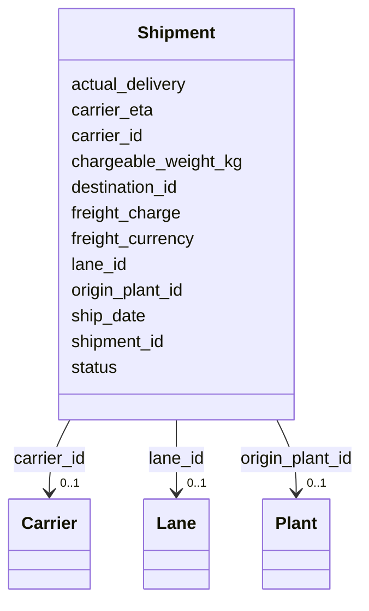

---
search:
  boost: 10.0
---

# Class: Shipment 


_A transport movement from origin to destination._


<div data-search-exclude markdown="1">


URI: [iof_scro:Shipment](https://spec.industrialontologies.org/ontology/supplychain/Shipment)





<!-- no inheritance hierarchy -->

## Class Properties

| Property | Value |
| --- | --- |
| Class URI | [iof_scro:Shipment](https://spec.industrialontologies.org/ontology/supplychain/Shipment) |


## Slots

| Name | Cardinality and Range | Description | Inheritance |
| ---  | --- | --- | --- |
| [shipment_id](shipment_id.md) | 1 <br/> [String](String.md) |  | direct |
| [carrier_id](carrier_id.md) | 0..1 <br/> [Carrier](Carrier.md) |  | direct |
| [lane_id](lane_id.md) | 0..1 <br/> [Lane](Lane.md) |  | direct |
| [origin_plant_id](origin_plant_id.md) | 0..1 <br/> [Plant](Plant.md) |  | direct |
| [destination_id](destination_id.md) | 0..1 <br/> [String](String.md) | Customer ship-to or inter-plant destination | direct |
| [ship_date](ship_date.md) | 0..1 <br/> [Date](Date.md) |  | direct |
| [carrier_eta](carrier_eta.md) | 0..1 <br/> [Date](Date.md) | Carrier-estimated arrival date | direct |
| [actual_delivery](actual_delivery.md) | 0..1 <br/> [Date](Date.md) | Actual delivery date from carrier confirmation | direct |
| [chargeable_weight_kg](chargeable_weight_kg.md) | 0..1 <br/> [Float](Float.md) |  | direct |
| [freight_charge](freight_charge.md) | 0..1 <br/> [Float](Float.md) |  | direct |
| [freight_currency](freight_currency.md) | 0..1 <br/> [String](String.md) |  | direct |
| [status](status.md) | 0..1 <br/> [String](String.md) | IN_TRANSIT, DELIVERED, EXCEPTION | direct |


## Usages

| used by | used in | type | used |
| ---  | --- | --- | --- |
| [ShipmentLine](ShipmentLine.md) | [shipment_id](shipment_id.md) | range | [Shipment](Shipment.md) |
| [DeliveryEvent](DeliveryEvent.md) | [shipment_id](shipment_id.md) | range | [Shipment](Shipment.md) |


## Identifier and Mapping Information


### Schema Source


* from schema: https://scm-ontology.example.com/schema


## Mappings

| Mapping Type | Mapped Value |
| ---  | ---  |
| self | iof_scro:Shipment |
| native | https://scm-ontology.example.com/schema/Shipment |


## LinkML Source

<!-- TODO: investigate https://stackoverflow.com/questions/37606292/how-to-create-tabbed-code-blocks-in-mkdocs-or-sphinx -->

### Direct

<details>
```yaml
name: Shipment
description: A transport movement from origin to destination.
from_schema: https://scm-ontology.example.com/schema
attributes:
  shipment_id:
    name: shipment_id
    from_schema: https://scm-ontology.example.com/schema
    rank: 1000
    identifier: true
    domain_of:
    - Shipment
    - ShipmentLine
    - DeliveryEvent
    range: string
  carrier_id:
    name: carrier_id
    from_schema: https://scm-ontology.example.com/schema
    rank: 1000
    domain_of:
    - Shipment
    - Carrier
    range: Carrier
  lane_id:
    name: lane_id
    from_schema: https://scm-ontology.example.com/schema
    rank: 1000
    domain_of:
    - Shipment
    - Lane
    range: Lane
  origin_plant_id:
    name: origin_plant_id
    from_schema: https://scm-ontology.example.com/schema
    rank: 1000
    domain_of:
    - Shipment
    range: Plant
  destination_id:
    name: destination_id
    description: Customer ship-to or inter-plant destination.
    from_schema: https://scm-ontology.example.com/schema
    rank: 1000
    domain_of:
    - Shipment
    range: string
  ship_date:
    name: ship_date
    from_schema: https://scm-ontology.example.com/schema
    rank: 1000
    domain_of:
    - Shipment
    range: date
  carrier_eta:
    name: carrier_eta
    description: Carrier-estimated arrival date.
    from_schema: https://scm-ontology.example.com/schema
    rank: 1000
    domain_of:
    - Shipment
    range: date
  actual_delivery:
    name: actual_delivery
    description: Actual delivery date from carrier confirmation.
    from_schema: https://scm-ontology.example.com/schema
    rank: 1000
    domain_of:
    - Shipment
    range: date
  chargeable_weight_kg:
    name: chargeable_weight_kg
    from_schema: https://scm-ontology.example.com/schema
    rank: 1000
    domain_of:
    - Shipment
    range: float
  freight_charge:
    name: freight_charge
    annotations:
      sensitivity:
        tag: sensitivity
        value: RESTRICTED
    from_schema: https://scm-ontology.example.com/schema
    rank: 1000
    domain_of:
    - Shipment
    range: float
  freight_currency:
    name: freight_currency
    from_schema: https://scm-ontology.example.com/schema
    rank: 1000
    domain_of:
    - Shipment
    range: string
  status:
    name: status
    description: IN_TRANSIT, DELIVERED, EXCEPTION.
    from_schema: https://scm-ontology.example.com/schema
    domain_of:
    - PurchaseOrderLine
    - SalesOrderLine
    - Shipment
    range: string
class_uri: iof_scro:Shipment

```
</details>

### Induced

<details>
```yaml
name: Shipment
description: A transport movement from origin to destination.
from_schema: https://scm-ontology.example.com/schema
attributes:
  shipment_id:
    name: shipment_id
    from_schema: https://scm-ontology.example.com/schema
    rank: 1000
    identifier: true
    owner: Shipment
    domain_of:
    - Shipment
    - ShipmentLine
    - DeliveryEvent
    range: string
    required: true
  carrier_id:
    name: carrier_id
    from_schema: https://scm-ontology.example.com/schema
    rank: 1000
    owner: Shipment
    domain_of:
    - Shipment
    - Carrier
    range: Carrier
  lane_id:
    name: lane_id
    from_schema: https://scm-ontology.example.com/schema
    rank: 1000
    owner: Shipment
    domain_of:
    - Shipment
    - Lane
    range: Lane
  origin_plant_id:
    name: origin_plant_id
    from_schema: https://scm-ontology.example.com/schema
    rank: 1000
    owner: Shipment
    domain_of:
    - Shipment
    range: Plant
  destination_id:
    name: destination_id
    description: Customer ship-to or inter-plant destination.
    from_schema: https://scm-ontology.example.com/schema
    rank: 1000
    owner: Shipment
    domain_of:
    - Shipment
    range: string
  ship_date:
    name: ship_date
    from_schema: https://scm-ontology.example.com/schema
    rank: 1000
    owner: Shipment
    domain_of:
    - Shipment
    range: date
  carrier_eta:
    name: carrier_eta
    description: Carrier-estimated arrival date.
    from_schema: https://scm-ontology.example.com/schema
    rank: 1000
    owner: Shipment
    domain_of:
    - Shipment
    range: date
  actual_delivery:
    name: actual_delivery
    description: Actual delivery date from carrier confirmation.
    from_schema: https://scm-ontology.example.com/schema
    rank: 1000
    owner: Shipment
    domain_of:
    - Shipment
    range: date
  chargeable_weight_kg:
    name: chargeable_weight_kg
    from_schema: https://scm-ontology.example.com/schema
    rank: 1000
    owner: Shipment
    domain_of:
    - Shipment
    range: float
  freight_charge:
    name: freight_charge
    annotations:
      sensitivity:
        tag: sensitivity
        value: RESTRICTED
    from_schema: https://scm-ontology.example.com/schema
    rank: 1000
    owner: Shipment
    domain_of:
    - Shipment
    range: float
  freight_currency:
    name: freight_currency
    from_schema: https://scm-ontology.example.com/schema
    rank: 1000
    owner: Shipment
    domain_of:
    - Shipment
    range: string
  status:
    name: status
    description: IN_TRANSIT, DELIVERED, EXCEPTION.
    from_schema: https://scm-ontology.example.com/schema
    owner: Shipment
    domain_of:
    - PurchaseOrderLine
    - SalesOrderLine
    - Shipment
    range: string
class_uri: iof_scro:Shipment

```
</details></div>