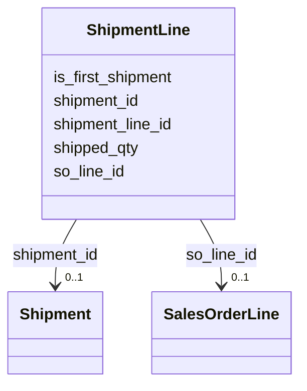

---
search:
  boost: 10.0
---

# Class: ShipmentLine 


_Links a sales order line to a shipment with the shipped quantity._


<div data-search-exclude markdown="1">


URI: [https://scm-ontology.example.com/schema/ShipmentLine](https://scm-ontology.example.com/schema/ShipmentLine)





<!-- no inheritance hierarchy -->

## Slots

| Name | Cardinality and Range | Description | Inheritance |
| ---  | --- | --- | --- |
| [shipment_line_id](shipment_line_id.md) | 1 <br/> [String](String.md) |  | direct |
| [shipment_id](shipment_id.md) | 0..1 <br/> [Shipment](Shipment.md) |  | direct |
| [so_line_id](so_line_id.md) | 0..1 <br/> [SalesOrderLine](SalesOrderLine.md) |  | direct |
| [shipped_qty](shipped_qty.md) | 0..1 <br/> [Float](Float.md) |  | direct |
| [is_first_shipment](is_first_shipment.md) | 0..1 <br/> [Boolean](Boolean.md) | True if this is the first shipment against the sales order line | direct |


## Identifier and Mapping Information


### Schema Source


* from schema: https://scm-ontology.example.com/schema


## Mappings

| Mapping Type | Mapped Value |
| ---  | ---  |
| self | https://scm-ontology.example.com/schema/ShipmentLine |
| native | https://scm-ontology.example.com/schema/ShipmentLine |


## LinkML Source

<!-- TODO: investigate https://stackoverflow.com/questions/37606292/how-to-create-tabbed-code-blocks-in-mkdocs-or-sphinx -->

### Direct

<details>
```yaml
name: ShipmentLine
description: Links a sales order line to a shipment with the shipped quantity.
from_schema: https://scm-ontology.example.com/schema
attributes:
  shipment_line_id:
    name: shipment_line_id
    from_schema: https://scm-ontology.example.com/schema
    rank: 1000
    identifier: true
    domain_of:
    - ShipmentLine
    range: string
  shipment_id:
    name: shipment_id
    from_schema: https://scm-ontology.example.com/schema
    domain_of:
    - Shipment
    - ShipmentLine
    - DeliveryEvent
    range: Shipment
  so_line_id:
    name: so_line_id
    from_schema: https://scm-ontology.example.com/schema
    domain_of:
    - SalesOrderLine
    - ShipmentLine
    range: SalesOrderLine
  shipped_qty:
    name: shipped_qty
    from_schema: https://scm-ontology.example.com/schema
    rank: 1000
    domain_of:
    - ShipmentLine
    range: float
  is_first_shipment:
    name: is_first_shipment
    description: True if this is the first shipment against the sales order line.
    from_schema: https://scm-ontology.example.com/schema
    rank: 1000
    domain_of:
    - ShipmentLine
    range: boolean

```
</details>

### Induced

<details>
```yaml
name: ShipmentLine
description: Links a sales order line to a shipment with the shipped quantity.
from_schema: https://scm-ontology.example.com/schema
attributes:
  shipment_line_id:
    name: shipment_line_id
    from_schema: https://scm-ontology.example.com/schema
    rank: 1000
    identifier: true
    owner: ShipmentLine
    domain_of:
    - ShipmentLine
    range: string
    required: true
  shipment_id:
    name: shipment_id
    from_schema: https://scm-ontology.example.com/schema
    owner: ShipmentLine
    domain_of:
    - Shipment
    - ShipmentLine
    - DeliveryEvent
    range: Shipment
  so_line_id:
    name: so_line_id
    from_schema: https://scm-ontology.example.com/schema
    owner: ShipmentLine
    domain_of:
    - SalesOrderLine
    - ShipmentLine
    range: SalesOrderLine
  shipped_qty:
    name: shipped_qty
    from_schema: https://scm-ontology.example.com/schema
    rank: 1000
    owner: ShipmentLine
    domain_of:
    - ShipmentLine
    range: float
  is_first_shipment:
    name: is_first_shipment
    description: True if this is the first shipment against the sales order line.
    from_schema: https://scm-ontology.example.com/schema
    rank: 1000
    owner: ShipmentLine
    domain_of:
    - ShipmentLine
    range: boolean

```
</details></div>