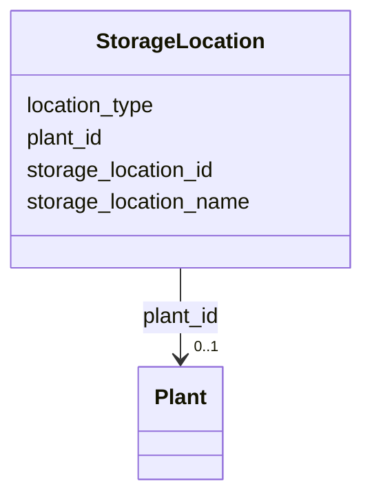

---
search:
  boost: 10.0
---

# Class: StorageLocation 


_A named location within a plant where inventory is held._


<div data-search-exclude markdown="1">


URI: [iof_scro:StorageLocation](https://spec.industrialontologies.org/ontology/supplychain/StorageLocation)





<!-- no inheritance hierarchy -->

## Class Properties

| Property | Value |
| --- | --- |
| Class URI | [iof_scro:StorageLocation](https://spec.industrialontologies.org/ontology/supplychain/StorageLocation) |


## Slots

| Name | Cardinality and Range | Description | Inheritance |
| ---  | --- | --- | --- |
| [storage_location_id](storage_location_id.md) | 1 <br/> [String](String.md) |  | direct |
| [storage_location_name](storage_location_name.md) | 0..1 <br/> [String](String.md) |  | direct |
| [plant_id](plant_id.md) | 0..1 <br/> [Plant](Plant.md) | The containing plant | direct |
| [location_type](location_type.md) | 0..1 <br/> [String](String.md) | RACK, BULK, COLD, YARD | direct |


## Usages

| used by | used in | type | used |
| ---  | --- | --- | --- |
| [SalesOrderLine](SalesOrderLine.md) | [fulfilled_from_location_id](fulfilled_from_location_id.md) | range | [StorageLocation](StorageLocation.md) |
| [InventorySnapshot](InventorySnapshot.md) | [storage_location_id](storage_location_id.md) | range | [StorageLocation](StorageLocation.md) |


## Identifier and Mapping Information


### Schema Source


* from schema: https://scm-ontology.example.com/schema


## Mappings

| Mapping Type | Mapped Value |
| ---  | ---  |
| self | iof_scro:StorageLocation |
| native | https://scm-ontology.example.com/schema/StorageLocation |


## LinkML Source

<!-- TODO: investigate https://stackoverflow.com/questions/37606292/how-to-create-tabbed-code-blocks-in-mkdocs-or-sphinx -->

### Direct

<details>
```yaml
name: StorageLocation
description: A named location within a plant where inventory is held.
from_schema: https://scm-ontology.example.com/schema
attributes:
  storage_location_id:
    name: storage_location_id
    from_schema: https://scm-ontology.example.com/schema
    rank: 1000
    identifier: true
    domain_of:
    - StorageLocation
    - InventorySnapshot
    range: string
  storage_location_name:
    name: storage_location_name
    from_schema: https://scm-ontology.example.com/schema
    rank: 1000
    domain_of:
    - StorageLocation
    range: string
  plant_id:
    name: plant_id
    description: The containing plant.
    from_schema: https://scm-ontology.example.com/schema
    domain_of:
    - Plant
    - StorageLocation
    range: Plant
  location_type:
    name: location_type
    description: RACK, BULK, COLD, YARD.
    from_schema: https://scm-ontology.example.com/schema
    rank: 1000
    domain_of:
    - StorageLocation
    range: string
class_uri: iof_scro:StorageLocation

```
</details>

### Induced

<details>
```yaml
name: StorageLocation
description: A named location within a plant where inventory is held.
from_schema: https://scm-ontology.example.com/schema
attributes:
  storage_location_id:
    name: storage_location_id
    from_schema: https://scm-ontology.example.com/schema
    rank: 1000
    identifier: true
    owner: StorageLocation
    domain_of:
    - StorageLocation
    - InventorySnapshot
    range: string
    required: true
  storage_location_name:
    name: storage_location_name
    from_schema: https://scm-ontology.example.com/schema
    rank: 1000
    owner: StorageLocation
    domain_of:
    - StorageLocation
    range: string
  plant_id:
    name: plant_id
    description: The containing plant.
    from_schema: https://scm-ontology.example.com/schema
    owner: StorageLocation
    domain_of:
    - Plant
    - StorageLocation
    range: Plant
  location_type:
    name: location_type
    description: RACK, BULK, COLD, YARD.
    from_schema: https://scm-ontology.example.com/schema
    rank: 1000
    owner: StorageLocation
    domain_of:
    - StorageLocation
    range: string
class_uri: iof_scro:StorageLocation

```
</details></div>