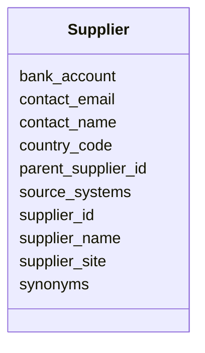

---
search:
  boost: 10.0
---

# Class: Supplier 


_An organisation that supplies parts under contractual agreements._


<div data-search-exclude markdown="1">


URI: [iof_scro:Supplier](https://spec.industrialontologies.org/ontology/supplychain/Supplier)





<!-- no inheritance hierarchy -->

## Class Properties

| Property | Value |
| --- | --- |
| Class URI | [iof_scro:Supplier](https://spec.industrialontologies.org/ontology/supplychain/Supplier) |


## Slots

| Name | Cardinality and Range | Description | Inheritance |
| ---  | --- | --- | --- |
| [supplier_id](supplier_id.md) | 1 <br/> [String](String.md) | Golden key for the supplier, resolved from crosswalk | direct |
| [supplier_name](supplier_name.md) | 0..1 <br/> [String](String.md) | Legal name of the supplier entity | direct |
| [supplier_site](supplier_site.md) | 0..1 <br/> [String](String.md) | Physical site identifier within the supplier organisation | direct |
| [parent_supplier_id](parent_supplier_id.md) | 0..1 <br/> [String](String.md) | Parent supplier in the supplier hierarchy (site > parent) | direct |
| [country_code](country_code.md) | 0..1 <br/> [String](String.md) | ISO 3166-1 alpha-2 country code of the supplier site | direct |
| [contact_name](contact_name.md) | 0..1 <br/> [String](String.md) | Primary contact name | direct |
| [contact_email](contact_email.md) | 0..1 <br/> [String](String.md) | Primary contact email | direct |
| [bank_account](bank_account.md) | 0..1 <br/> [String](String.md) | Bank account number for payments | direct |
| [source_systems](source_systems.md) | * <br/> [String](String.md) | Systems of record (erp, portal) | direct |
| [synonyms](synonyms.md) | * <br/> [String](String.md) | Alternative names (vendor, seller) | direct |


## Usages

| used by | used in | type | used |
| ---  | --- | --- | --- |
| [SupplierPartAgreement](SupplierPartAgreement.md) | [supplier_id](supplier_id.md) | range | [Supplier](Supplier.md) |
| [PurchaseOrderLine](PurchaseOrderLine.md) | [supplier_id](supplier_id.md) | range | [Supplier](Supplier.md) |


## Identifier and Mapping Information


### Schema Source


* from schema: https://scm-ontology.example.com/schema


## Mappings

| Mapping Type | Mapped Value |
| ---  | ---  |
| self | iof_scro:Supplier |
| native | https://scm-ontology.example.com/schema/Supplier |


## LinkML Source

<!-- TODO: investigate https://stackoverflow.com/questions/37606292/how-to-create-tabbed-code-blocks-in-mkdocs-or-sphinx -->

### Direct

<details>
```yaml
name: Supplier
description: An organisation that supplies parts under contractual agreements.
from_schema: https://scm-ontology.example.com/schema
attributes:
  supplier_id:
    name: supplier_id
    description: Golden key for the supplier, resolved from crosswalk.
    from_schema: https://scm-ontology.example.com/schema
    rank: 1000
    identifier: true
    domain_of:
    - Supplier
    - SupplierPartAgreement
    - PurchaseOrderLine
    range: string
  supplier_name:
    name: supplier_name
    description: Legal name of the supplier entity.
    from_schema: https://scm-ontology.example.com/schema
    rank: 1000
    domain_of:
    - Supplier
    range: string
  supplier_site:
    name: supplier_site
    description: Physical site identifier within the supplier organisation.
    from_schema: https://scm-ontology.example.com/schema
    rank: 1000
    domain_of:
    - Supplier
    range: string
  parent_supplier_id:
    name: parent_supplier_id
    description: Parent supplier in the supplier hierarchy (site > parent).
    from_schema: https://scm-ontology.example.com/schema
    rank: 1000
    domain_of:
    - Supplier
    range: string
  country_code:
    name: country_code
    description: ISO 3166-1 alpha-2 country code of the supplier site.
    from_schema: https://scm-ontology.example.com/schema
    rank: 1000
    domain_of:
    - Supplier
    - Plant
    - Customer
    range: string
  contact_name:
    name: contact_name
    annotations:
      sensitivity:
        tag: sensitivity
        value: CONFIDENTIAL
    description: Primary contact name.
    from_schema: https://scm-ontology.example.com/schema
    rank: 1000
    domain_of:
    - Supplier
    - Customer
    range: string
  contact_email:
    name: contact_email
    annotations:
      sensitivity:
        tag: sensitivity
        value: CONFIDENTIAL
    description: Primary contact email.
    from_schema: https://scm-ontology.example.com/schema
    rank: 1000
    domain_of:
    - Supplier
    - Customer
    range: string
  bank_account:
    name: bank_account
    annotations:
      sensitivity:
        tag: sensitivity
        value: RESTRICTED
    description: Bank account number for payments.
    from_schema: https://scm-ontology.example.com/schema
    rank: 1000
    domain_of:
    - Supplier
    range: string
  source_systems:
    name: source_systems
    description: Systems of record (erp, portal).
    from_schema: https://scm-ontology.example.com/schema
    rank: 1000
    domain_of:
    - Supplier
    - Part
    range: string
    multivalued: true
  synonyms:
    name: synonyms
    description: Alternative names (vendor, seller).
    from_schema: https://scm-ontology.example.com/schema
    rank: 1000
    domain_of:
    - Supplier
    range: string
    multivalued: true
class_uri: iof_scro:Supplier

```
</details>

### Induced

<details>
```yaml
name: Supplier
description: An organisation that supplies parts under contractual agreements.
from_schema: https://scm-ontology.example.com/schema
attributes:
  supplier_id:
    name: supplier_id
    description: Golden key for the supplier, resolved from crosswalk.
    from_schema: https://scm-ontology.example.com/schema
    rank: 1000
    identifier: true
    owner: Supplier
    domain_of:
    - Supplier
    - SupplierPartAgreement
    - PurchaseOrderLine
    range: string
    required: true
  supplier_name:
    name: supplier_name
    description: Legal name of the supplier entity.
    from_schema: https://scm-ontology.example.com/schema
    rank: 1000
    owner: Supplier
    domain_of:
    - Supplier
    range: string
  supplier_site:
    name: supplier_site
    description: Physical site identifier within the supplier organisation.
    from_schema: https://scm-ontology.example.com/schema
    rank: 1000
    owner: Supplier
    domain_of:
    - Supplier
    range: string
  parent_supplier_id:
    name: parent_supplier_id
    description: Parent supplier in the supplier hierarchy (site > parent).
    from_schema: https://scm-ontology.example.com/schema
    rank: 1000
    owner: Supplier
    domain_of:
    - Supplier
    range: string
  country_code:
    name: country_code
    description: ISO 3166-1 alpha-2 country code of the supplier site.
    from_schema: https://scm-ontology.example.com/schema
    rank: 1000
    owner: Supplier
    domain_of:
    - Supplier
    - Plant
    - Customer
    range: string
  contact_name:
    name: contact_name
    annotations:
      sensitivity:
        tag: sensitivity
        value: CONFIDENTIAL
    description: Primary contact name.
    from_schema: https://scm-ontology.example.com/schema
    rank: 1000
    owner: Supplier
    domain_of:
    - Supplier
    - Customer
    range: string
  contact_email:
    name: contact_email
    annotations:
      sensitivity:
        tag: sensitivity
        value: CONFIDENTIAL
    description: Primary contact email.
    from_schema: https://scm-ontology.example.com/schema
    rank: 1000
    owner: Supplier
    domain_of:
    - Supplier
    - Customer
    range: string
  bank_account:
    name: bank_account
    annotations:
      sensitivity:
        tag: sensitivity
        value: RESTRICTED
    description: Bank account number for payments.
    from_schema: https://scm-ontology.example.com/schema
    rank: 1000
    owner: Supplier
    domain_of:
    - Supplier
    range: string
  source_systems:
    name: source_systems
    description: Systems of record (erp, portal).
    from_schema: https://scm-ontology.example.com/schema
    rank: 1000
    owner: Supplier
    domain_of:
    - Supplier
    - Part
    range: string
    multivalued: true
  synonyms:
    name: synonyms
    description: Alternative names (vendor, seller).
    from_schema: https://scm-ontology.example.com/schema
    rank: 1000
    owner: Supplier
    domain_of:
    - Supplier
    range: string
    multivalued: true
class_uri: iof_scro:Supplier

```
</details></div>