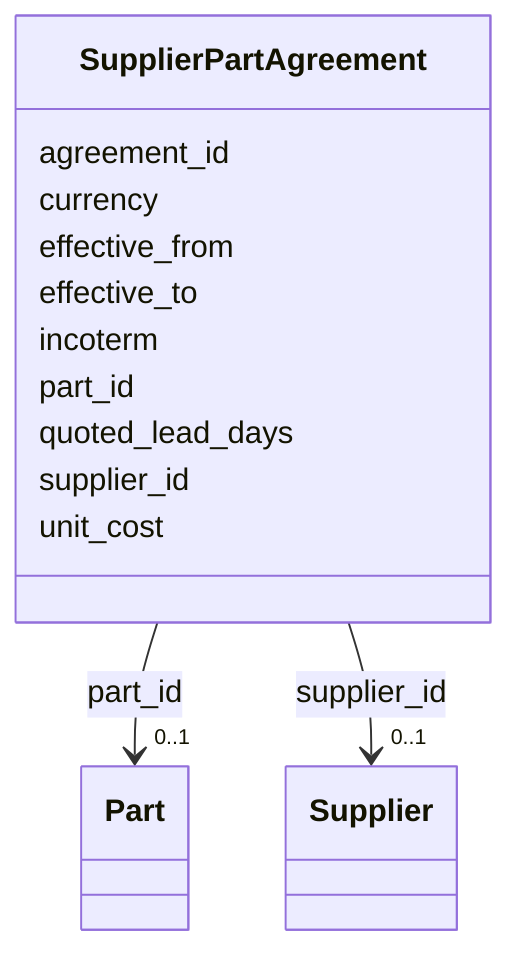

---
search:
  boost: 10.0
---

# Class: SupplierPartAgreement 


_A contractual agreement for a supplier to supply a specific part._


<div data-search-exclude markdown="1">


URI: [iof_scro:SupplyAgreement](https://spec.industrialontologies.org/ontology/supplychain/SupplyAgreement)





<!-- no inheritance hierarchy -->

## Class Properties

| Property | Value |
| --- | --- |
| Class URI | [iof_scro:SupplyAgreement](https://spec.industrialontologies.org/ontology/supplychain/SupplyAgreement) |


## Slots

| Name | Cardinality and Range | Description | Inheritance |
| ---  | --- | --- | --- |
| [agreement_id](agreement_id.md) | 1 <br/> [String](String.md) |  | direct |
| [supplier_id](supplier_id.md) | 0..1 <br/> [Supplier](Supplier.md) | The supplying party | direct |
| [part_id](part_id.md) | 0..1 <br/> [Part](Part.md) | The supplied part | direct |
| [unit_cost](unit_cost.md) | 0..1 <br/> [Float](Float.md) | Agreed unit cost in the transaction currency | direct |
| [currency](currency.md) | 0..1 <br/> [String](String.md) | ISO 4217 currency code | direct |
| [incoterm](incoterm.md) | 0..1 <br/> [String](String.md) | Incoterms 2020 rule (EXW, FOB, CIF, DDP) | direct |
| [quoted_lead_days](quoted_lead_days.md) | 0..1 <br/> [Integer](Integer.md) | Supplier-quoted lead time in calendar days | direct |
| [effective_from](effective_from.md) | 0..1 <br/> [Date](Date.md) |  | direct |
| [effective_to](effective_to.md) | 0..1 <br/> [Date](Date.md) |  | direct |


## Identifier and Mapping Information


### Schema Source


* from schema: https://scm-ontology.example.com/schema


## Mappings

| Mapping Type | Mapped Value |
| ---  | ---  |
| self | iof_scro:SupplyAgreement |
| native | https://scm-ontology.example.com/schema/SupplierPartAgreement |


## LinkML Source

<!-- TODO: investigate https://stackoverflow.com/questions/37606292/how-to-create-tabbed-code-blocks-in-mkdocs-or-sphinx -->

### Direct

<details>
```yaml
name: SupplierPartAgreement
description: A contractual agreement for a supplier to supply a specific part.
from_schema: https://scm-ontology.example.com/schema
attributes:
  agreement_id:
    name: agreement_id
    from_schema: https://scm-ontology.example.com/schema
    rank: 1000
    identifier: true
    domain_of:
    - SupplierPartAgreement
    range: string
  supplier_id:
    name: supplier_id
    description: The supplying party.
    from_schema: https://scm-ontology.example.com/schema
    domain_of:
    - Supplier
    - SupplierPartAgreement
    - PurchaseOrderLine
    range: Supplier
  part_id:
    name: part_id
    description: The supplied part.
    from_schema: https://scm-ontology.example.com/schema
    domain_of:
    - Part
    - SupplierPartAgreement
    - PurchaseOrderLine
    - SalesOrderLine
    - InventorySnapshot
    - TariffCode
    range: Part
  unit_cost:
    name: unit_cost
    annotations:
      sensitivity:
        tag: sensitivity
        value: RESTRICTED
    description: Agreed unit cost in the transaction currency.
    from_schema: https://scm-ontology.example.com/schema
    rank: 1000
    domain_of:
    - SupplierPartAgreement
    - PurchaseOrderLine
    range: float
  currency:
    name: currency
    description: ISO 4217 currency code.
    from_schema: https://scm-ontology.example.com/schema
    rank: 1000
    domain_of:
    - SupplierPartAgreement
    - PurchaseOrderLine
    - SalesOrderLine
    range: string
  incoterm:
    name: incoterm
    description: Incoterms 2020 rule (EXW, FOB, CIF, DDP).
    from_schema: https://scm-ontology.example.com/schema
    rank: 1000
    domain_of:
    - SupplierPartAgreement
    range: string
  quoted_lead_days:
    name: quoted_lead_days
    description: Supplier-quoted lead time in calendar days.
    from_schema: https://scm-ontology.example.com/schema
    rank: 1000
    domain_of:
    - SupplierPartAgreement
    range: integer
  effective_from:
    name: effective_from
    from_schema: https://scm-ontology.example.com/schema
    rank: 1000
    domain_of:
    - SupplierPartAgreement
    - TariffCode
    range: date
  effective_to:
    name: effective_to
    from_schema: https://scm-ontology.example.com/schema
    rank: 1000
    domain_of:
    - SupplierPartAgreement
    - TariffCode
    range: date
class_uri: iof_scro:SupplyAgreement

```
</details>

### Induced

<details>
```yaml
name: SupplierPartAgreement
description: A contractual agreement for a supplier to supply a specific part.
from_schema: https://scm-ontology.example.com/schema
attributes:
  agreement_id:
    name: agreement_id
    from_schema: https://scm-ontology.example.com/schema
    rank: 1000
    identifier: true
    owner: SupplierPartAgreement
    domain_of:
    - SupplierPartAgreement
    range: string
    required: true
  supplier_id:
    name: supplier_id
    description: The supplying party.
    from_schema: https://scm-ontology.example.com/schema
    owner: SupplierPartAgreement
    domain_of:
    - Supplier
    - SupplierPartAgreement
    - PurchaseOrderLine
    range: Supplier
  part_id:
    name: part_id
    description: The supplied part.
    from_schema: https://scm-ontology.example.com/schema
    owner: SupplierPartAgreement
    domain_of:
    - Part
    - SupplierPartAgreement
    - PurchaseOrderLine
    - SalesOrderLine
    - InventorySnapshot
    - TariffCode
    range: Part
  unit_cost:
    name: unit_cost
    annotations:
      sensitivity:
        tag: sensitivity
        value: RESTRICTED
    description: Agreed unit cost in the transaction currency.
    from_schema: https://scm-ontology.example.com/schema
    rank: 1000
    owner: SupplierPartAgreement
    domain_of:
    - SupplierPartAgreement
    - PurchaseOrderLine
    range: float
  currency:
    name: currency
    description: ISO 4217 currency code.
    from_schema: https://scm-ontology.example.com/schema
    rank: 1000
    owner: SupplierPartAgreement
    domain_of:
    - SupplierPartAgreement
    - PurchaseOrderLine
    - SalesOrderLine
    range: string
  incoterm:
    name: incoterm
    description: Incoterms 2020 rule (EXW, FOB, CIF, DDP).
    from_schema: https://scm-ontology.example.com/schema
    rank: 1000
    owner: SupplierPartAgreement
    domain_of:
    - SupplierPartAgreement
    range: string
  quoted_lead_days:
    name: quoted_lead_days
    description: Supplier-quoted lead time in calendar days.
    from_schema: https://scm-ontology.example.com/schema
    rank: 1000
    owner: SupplierPartAgreement
    domain_of:
    - SupplierPartAgreement
    range: integer
  effective_from:
    name: effective_from
    from_schema: https://scm-ontology.example.com/schema
    rank: 1000
    owner: SupplierPartAgreement
    domain_of:
    - SupplierPartAgreement
    - TariffCode
    range: date
  effective_to:
    name: effective_to
    from_schema: https://scm-ontology.example.com/schema
    rank: 1000
    owner: SupplierPartAgreement
    domain_of:
    - SupplierPartAgreement
    - TariffCode
    range: date
class_uri: iof_scro:SupplyAgreement

```
</details></div>