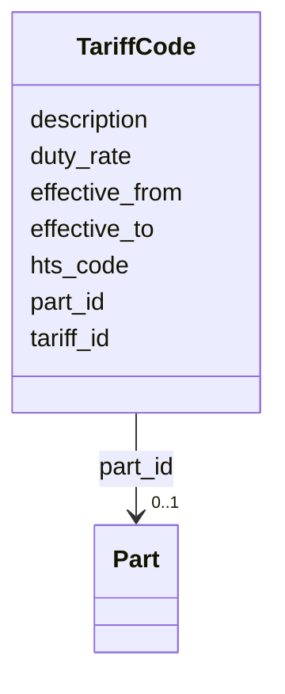

---
search:
  boost: 10.0
---

# Class: TariffCode 


_An HTS tariff classification with duty rates and effective dates._


<div data-search-exclude markdown="1">


URI: [https://scm-ontology.example.com/schema/TariffCode](https://scm-ontology.example.com/schema/TariffCode)





<!-- no inheritance hierarchy -->

## Slots

| Name | Cardinality and Range | Description | Inheritance |
| ---  | --- | --- | --- |
| [tariff_id](tariff_id.md) | 1 <br/> [String](String.md) |  | direct |
| [hts_code](hts_code.md) | 0..1 <br/> [String](String.md) | Harmonized Tariff Schedule code (6 or 10 digit) | direct |
| [description](description.md) | 0..1 <br/> [String](String.md) |  | direct |
| [duty_rate](duty_rate.md) | 0..1 <br/> [Float](Float.md) | Ad valorem duty rate as a decimal (0 | direct |
| [effective_from](effective_from.md) | 0..1 <br/> [Date](Date.md) |  | direct |
| [effective_to](effective_to.md) | 0..1 <br/> [Date](Date.md) |  | direct |
| [part_id](part_id.md) | 0..1 <br/> [Part](Part.md) | The part classified under this tariff code | direct |


## Identifier and Mapping Information


### Schema Source


* from schema: https://scm-ontology.example.com/schema


## Mappings

| Mapping Type | Mapped Value |
| ---  | ---  |
| self | https://scm-ontology.example.com/schema/TariffCode |
| native | https://scm-ontology.example.com/schema/TariffCode |


## LinkML Source

<!-- TODO: investigate https://stackoverflow.com/questions/37606292/how-to-create-tabbed-code-blocks-in-mkdocs-or-sphinx -->

### Direct

<details>
```yaml
name: TariffCode
description: An HTS tariff classification with duty rates and effective dates.
from_schema: https://scm-ontology.example.com/schema
attributes:
  tariff_id:
    name: tariff_id
    from_schema: https://scm-ontology.example.com/schema
    rank: 1000
    identifier: true
    domain_of:
    - TariffCode
    range: string
  hts_code:
    name: hts_code
    description: Harmonized Tariff Schedule code (6 or 10 digit).
    from_schema: https://scm-ontology.example.com/schema
    rank: 1000
    domain_of:
    - TariffCode
    range: string
  description:
    name: description
    from_schema: https://scm-ontology.example.com/schema
    rank: 1000
    domain_of:
    - TariffCode
    range: string
  duty_rate:
    name: duty_rate
    description: Ad valorem duty rate as a decimal (0.05 = 5%).
    from_schema: https://scm-ontology.example.com/schema
    rank: 1000
    domain_of:
    - TariffCode
    range: float
  effective_from:
    name: effective_from
    from_schema: https://scm-ontology.example.com/schema
    domain_of:
    - SupplierPartAgreement
    - TariffCode
    range: date
  effective_to:
    name: effective_to
    from_schema: https://scm-ontology.example.com/schema
    domain_of:
    - SupplierPartAgreement
    - TariffCode
    range: date
  part_id:
    name: part_id
    description: The part classified under this tariff code.
    from_schema: https://scm-ontology.example.com/schema
    domain_of:
    - Part
    - SupplierPartAgreement
    - PurchaseOrderLine
    - SalesOrderLine
    - InventorySnapshot
    - TariffCode
    range: Part

```
</details>

### Induced

<details>
```yaml
name: TariffCode
description: An HTS tariff classification with duty rates and effective dates.
from_schema: https://scm-ontology.example.com/schema
attributes:
  tariff_id:
    name: tariff_id
    from_schema: https://scm-ontology.example.com/schema
    rank: 1000
    identifier: true
    owner: TariffCode
    domain_of:
    - TariffCode
    range: string
    required: true
  hts_code:
    name: hts_code
    description: Harmonized Tariff Schedule code (6 or 10 digit).
    from_schema: https://scm-ontology.example.com/schema
    rank: 1000
    owner: TariffCode
    domain_of:
    - TariffCode
    range: string
  description:
    name: description
    from_schema: https://scm-ontology.example.com/schema
    rank: 1000
    owner: TariffCode
    domain_of:
    - TariffCode
    range: string
  duty_rate:
    name: duty_rate
    description: Ad valorem duty rate as a decimal (0.05 = 5%).
    from_schema: https://scm-ontology.example.com/schema
    rank: 1000
    owner: TariffCode
    domain_of:
    - TariffCode
    range: float
  effective_from:
    name: effective_from
    from_schema: https://scm-ontology.example.com/schema
    owner: TariffCode
    domain_of:
    - SupplierPartAgreement
    - TariffCode
    range: date
  effective_to:
    name: effective_to
    from_schema: https://scm-ontology.example.com/schema
    owner: TariffCode
    domain_of:
    - SupplierPartAgreement
    - TariffCode
    range: date
  part_id:
    name: part_id
    description: The part classified under this tariff code.
    from_schema: https://scm-ontology.example.com/schema
    owner: TariffCode
    domain_of:
    - Part
    - SupplierPartAgreement
    - PurchaseOrderLine
    - SalesOrderLine
    - InventorySnapshot
    - TariffCode
    range: Part

```
</details></div>