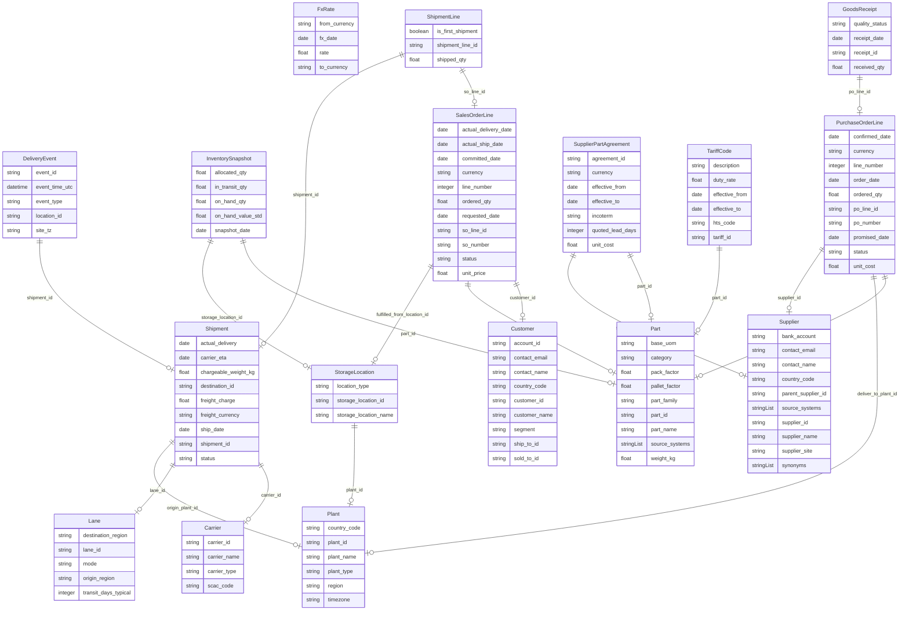

```mermaid
erDiagram
Carrier {
    string carrier_id  
    string carrier_name  
    string carrier_type  
    string scac_code  
}
Customer {
    string account_id  
    string contact_email  
    string contact_name  
    string country_code  
    string customer_id  
    string customer_name  
    string segment  
    string ship_to_id  
    string sold_to_id  
}
DeliveryEvent {
    string event_id  
    datetime event_time_utc  
    string event_type  
    string location_id  
    string site_tz  
}
FxRate {
    string from_currency  
    date fx_date  
    float rate  
    string to_currency  
}
GoodsReceipt {
    string quality_status  
    date receipt_date  
    string receipt_id  
    float received_qty  
}
InventorySnapshot {
    float allocated_qty  
    float in_transit_qty  
    float on_hand_qty  
    float on_hand_value_std  
    date snapshot_date  
}
Lane {
    string destination_region  
    string lane_id  
    string mode  
    string origin_region  
    integer transit_days_typical  
}
Part {
    string base_uom  
    string category  
    float pack_factor  
    float pallet_factor  
    string part_family  
    string part_id  
    string part_name  
    stringList source_systems  
    float weight_kg  
}
Plant {
    string country_code  
    string plant_id  
    string plant_name  
    string plant_type  
    string region  
    string timezone  
}
PurchaseOrderLine {
    date confirmed_date  
    string currency  
    integer line_number  
    date order_date  
    float ordered_qty  
    string po_line_id  
    string po_number  
    date promised_date  
    string status  
    float unit_cost  
}
SalesOrderLine {
    date actual_delivery_date  
    date actual_ship_date  
    date committed_date  
    string currency  
    integer line_number  
    float ordered_qty  
    date requested_date  
    string so_line_id  
    string so_number  
    string status  
    float unit_price  
}
Shipment {
    date actual_delivery  
    date carrier_eta  
    float chargeable_weight_kg  
    string destination_id  
    float freight_charge  
    string freight_currency  
    date ship_date  
    string shipment_id  
    string status  
}
ShipmentLine {
    boolean is_first_shipment  
    string shipment_line_id  
    float shipped_qty  
}
StorageLocation {
    string location_type  
    string storage_location_id  
    string storage_location_name  
}
Supplier {
    string bank_account  
    string contact_email  
    string contact_name  
    string country_code  
    string parent_supplier_id  
    stringList source_systems  
    string supplier_id  
    string supplier_name  
    string supplier_site  
    stringList synonyms  
}
SupplierPartAgreement {
    string agreement_id  
    string currency  
    date effective_from  
    date effective_to  
    string incoterm  
    integer quoted_lead_days  
    float unit_cost  
}
TariffCode {
    string description  
    float duty_rate  
    date effective_from  
    date effective_to  
    string hts_code  
    string tariff_id  
}

DeliveryEvent ||--|o Shipment : "shipment_id"
GoodsReceipt ||--|o PurchaseOrderLine : "po_line_id"
InventorySnapshot ||--|o Part : "part_id"
InventorySnapshot ||--|o StorageLocation : "storage_location_id"
PurchaseOrderLine ||--|o Part : "part_id"
PurchaseOrderLine ||--|o Plant : "deliver_to_plant_id"
PurchaseOrderLine ||--|o Supplier : "supplier_id"
SalesOrderLine ||--|o Customer : "customer_id"
SalesOrderLine ||--|o Part : "part_id"
SalesOrderLine ||--|o StorageLocation : "fulfilled_from_location_id"
Shipment ||--|o Carrier : "carrier_id"
Shipment ||--|o Lane : "lane_id"
Shipment ||--|o Plant : "origin_plant_id"
ShipmentLine ||--|o SalesOrderLine : "so_line_id"
ShipmentLine ||--|o Shipment : "shipment_id"
StorageLocation ||--|o Plant : "plant_id"
SupplierPartAgreement ||--|o Part : "part_id"
SupplierPartAgreement ||--|o Supplier : "supplier_id"
TariffCode ||--|o Part : "part_id"

```

